# Deney Özeti (otomatik)
## Veri
- Beyin MR: 3064 kesit, 233 hasta, sınıflar {'glioma': 1426, 'pituitary': 930, 'meningioma': 708}, birden fazla katta görünen hasta: 0
- COVID-QU-Ex: {'Test/COVID-19': 2395, 'Test/Non-COVID': 2253, 'Test/Normal': 2140, 'Train/COVID-19': 7658, 'Train/Non-COVID': 7208, 'Train/Normal': 6849, 'Val/COVID-19': 1903, 'Val/Non-COVID': 1802, 'Val/Normal': 1712}
- Kaggle CXR: {'test/COVID19': 116, 'test/NORMAL': 317, 'test/PNEUMONIA': 855, 'train/COVID19': 460, 'train/NORMAL': 1266, 'train/PNEUMONIA': 3418}
- COVID-QU-Ex'te kopyası olan Kaggle görüntüsü: 4665/6432

## Π_ROI yeniden üretimi
| size | ornek | rho | maks_mutlak_hata | toplam_s |
|---|---|---|---|---|
| 64 | beyin MR, tümör maskesi | 0.0176 | 1.43e-06 | 1.29 |
| 64 | akciğer grafisi, akciğer maskesi | 0.2 | 3.02e-06 | 1.69 |
| 128 | beyin MR, tümör maskesi | 0.0175 | 1.27e-06 | 1.68 |
| 128 | akciğer grafisi, akciğer maskesi | 0.198 | 4.12e-06 | 1.95 |

| size | rho | ciphertext_sayisi | sifreli_slot | sifreleme_s | sunucu_s | toplam_s | hiz_kazanci_toplam | yukleme_MB |
|---|---|---|---|---|---|---|---|---|
| 64 | 0.009 | 1 | 64 | 0.012 | 1.205 | 1.237 | 1.599 | 0.855 |
| 64 | 0.048 | 1 | 256 | 0.011 | 1.483 | 1.512 | 1.308 | 0.855 |
| 64 | 0.098 | 1 | 512 | 0.011 | 1.556 | 1.587 | 1.246 | 0.856 |
| 64 | 0.250 | 1 | 1024 | 0.011 | 1.670 | 1.701 | 1.163 | 0.856 |
| 64 | 0.494 | 1 | 2048 | 0.011 | 1.648 | 1.676 | 1.180 | 0.856 |
| 64 | 0.739 | 1 | 4096 | 0.012 | 1.762 | 1.793 | 1.103 | 0.856 |
| 64 | 0.908 | 1 | 4096 | 0.012 | 1.944 | 1.977 | 1.001 | 0.856 |
| 64 | 1.000 | 1 | 4096 | 0.012 | 1.947 | 1.978 | 1.000 | 0.856 |
| 128 | 0.010 | 1 | 256 | 0.012 | 1.457 | 1.490 | 2.476 | 0.855 |
| 128 | 0.051 | 1 | 1024 | 0.013 | 1.749 | 1.784 | 2.067 | 0.855 |
| 128 | 0.098 | 1 | 2048 | 0.012 | 1.818 | 1.852 | 1.992 | 0.856 |
| 128 | 0.250 | 1 | 4096 | 0.014 | 1.960 | 1.997 | 1.847 | 0.855 |
| 128 | 0.505 | 2 | 8320 | 0.022 | 2.666 | 2.706 | 1.363 | 1.711 |
| 128 | 0.752 | 2 | 16384 | 0.026 | 3.766 | 3.813 | 0.967 | 1.712 |
| 128 | 0.894 | 2 | 16384 | 0.029 | 3.738 | 3.785 | 0.974 | 1.711 |
| 128 | 1.000 | 2 | 16384 | 0.025 | 3.644 | 3.689 | 1.000 | 1.712 |
| 256 | 0.010 | 1 | 1024 | 0.011 | 1.602 | 1.631 | 8.942 | 0.856 |
| 256 | 0.050 | 1 | 4096 | 0.012 | 2.008 | 2.040 | 7.151 | 0.855 |
| 256 | 0.100 | 1 | 8192 | 0.014 | 2.106 | 2.137 | 6.824 | 0.856 |
| 256 | 0.250 | 2 | 16384 | 0.027 | 3.737 | 3.786 | 3.852 | 1.711 |
| 256 | 0.500 | 4 | 32768 | 0.056 | 7.234 | 7.311 | 1.995 | 3.424 |
| 256 | 0.752 | 7 | 49408 | 0.094 | 11.925 | 12.042 | 1.211 | 5.990 |
| 256 | 0.901 | 8 | 59392 | 0.104 | 14.052 | 14.176 | 1.029 | 6.845 |
| 256 | 1.000 | 8 | 65536 | 0.117 | 14.446 | 14.584 | 1.000 | 6.844 |
| 512 | 0.010 | 1 | 4096 | 0.015 | 2.038 | 2.072 | 27.336 | 0.856 |
| 512 | 0.050 | 2 | 16384 | 0.024 | 3.847 | 3.892 | 14.552 | 1.711 |
| 512 | 0.100 | 4 | 26624 | 0.049 | 7.006 | 7.074 | 8.007 | 3.422 |
| 512 | 0.250 | 8 | 65536 | 0.105 | 14.211 | 14.340 | 3.950 | 6.844 |
| 512 | 0.500 | 16 | 131072 | 0.238 | 28.919 | 29.181 | 1.941 | 13.694 |
| 512 | 0.749 | 24 | 196608 | 0.327 | 41.676 | 42.022 | 1.348 | 20.537 |
| 512 | 0.901 | 29 | 237568 | 0.379 | 51.511 | 51.909 | 1.091 | 24.813 |
| 512 | 1.000 | 32 | 262144 | 0.411 | 56.202 | 56.637 | 1.000 | 27.381 |

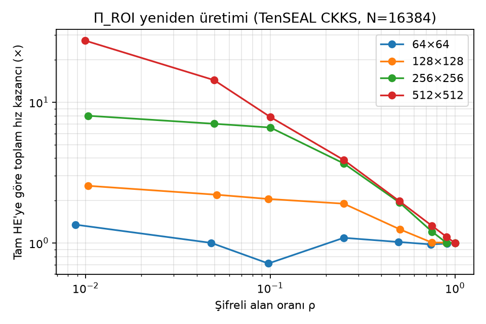

## Saldırı A: yalnızca ROI meta verisi
| veri | hedef | roi | oznitelik_grubu | auc_ort | ci95_alt | ci95_ust | n |
|---|---|---|---|---|---|---|---|
| akciğer grafisi (COVID-QU-Ex) | teşhis (3 sınıf) | akciğer maskesi | konum | 0.729 | 0.720 | 0.739 | 6788 |
| akciğer grafisi (COVID-QU-Ex) | teşhis (3 sınıf) | akciğer maskesi | buyukluk | 0.765 | 0.757 | 0.775 | 6788 |
| akciğer grafisi (COVID-QU-Ex) | teşhis (3 sınıf) | akciğer maskesi | sekil | 0.780 | 0.771 | 0.788 | 6788 |
| akciğer grafisi (COVID-QU-Ex) | teşhis (3 sınıf) | akciğer maskesi | tumu | 0.834 | 0.827 | 0.841 | 6788 |
| akciğer grafisi (COVID-QU-Ex) | Normal / Non-COVID | akciğer maskesi | konum | 0.788 | 0.772 | 0.798 | 4393 |
| akciğer grafisi (COVID-QU-Ex) | Normal / Non-COVID | akciğer maskesi | buyukluk | 0.824 | 0.812 | 0.837 | 4393 |
| akciğer grafisi (COVID-QU-Ex) | Normal / Non-COVID | akciğer maskesi | sekil | 0.873 | 0.862 | 0.883 | 4393 |
| akciğer grafisi (COVID-QU-Ex) | Normal / Non-COVID | akciğer maskesi | tumu | 0.904 | 0.895 | 0.913 | 4393 |
| akciğer grafisi (COVID-QU-Ex) | Normal / COVID-19 | akciğer maskesi | konum | 0.779 | 0.765 | 0.791 | 4535 |
| akciğer grafisi (COVID-QU-Ex) | Normal / COVID-19 | akciğer maskesi | buyukluk | 0.777 | 0.767 | 0.793 | 4535 |
| akciğer grafisi (COVID-QU-Ex) | Normal / COVID-19 | akciğer maskesi | sekil | 0.790 | 0.780 | 0.803 | 4535 |
| akciğer grafisi (COVID-QU-Ex) | Normal / COVID-19 | akciğer maskesi | tumu | 0.853 | 0.842 | 0.863 | 4535 |
| akciğer grafisi (COVID-QU-Ex) | Non-COVID / COVID-19 | akciğer maskesi | konum | 0.694 | 0.680 | 0.708 | 4648 |
| akciğer grafisi (COVID-QU-Ex) | Non-COVID / COVID-19 | akciğer maskesi | buyukluk | 0.781 | 0.766 | 0.792 | 4648 |
| akciğer grafisi (COVID-QU-Ex) | Non-COVID / COVID-19 | akciğer maskesi | sekil | 0.783 | 0.770 | 0.795 | 4648 |
| akciğer grafisi (COVID-QU-Ex) | Non-COVID / COVID-19 | akciğer maskesi | tumu | 0.832 | 0.820 | 0.842 | 4648 |
| akciğer grafisi (COVID-QU-Ex, enfeksiyon alt kümesi) | COVID-19 / diğer | enfeksiyon (lezyon) maskesi | yalnızca ROI alanı | 1.000 |  |  | 5826 |
| akciğer grafisi (Kaggle, orijinal çözünürlük) | NORMAL / PNEUMONIA | (ROI'den bağımsız) | girdi_boyutu | 0.934 |  |  | 1172 |
| akciğer grafisi (Kaggle, orijinal çözünürlük) | NORMAL / COVID19 | (ROI'den bağımsız) | girdi_boyutu | 0.920 |  |  | 433 |
| beyin MR (Cheng) | tümör tipi (3 sınıf) | tümör maskesi | girdi_boyutu | 0.457 | 0.401 | 0.519 | 3064 |
| beyin MR (Cheng) | tümör tipi (3 sınıf) | tümör maskesi | konum | 0.775 | 0.743 | 0.804 | 3064 |
| beyin MR (Cheng) | tümör tipi (3 sınıf) | tümör maskesi | buyukluk | 0.708 | 0.674 | 0.736 | 3064 |
| beyin MR (Cheng) | tümör tipi (3 sınıf) | tümör maskesi | sekil | 0.722 | 0.691 | 0.747 | 3064 |
| beyin MR (Cheng) | tümör tipi (3 sınıf) | tümör maskesi | tumu | 0.830 | 0.801 | 0.855 | 3064 |

Beyin, sınıf bazında (bire karşı hepsi) AUC: {'meningioma': 0.7138445656240109, 'glioma': 0.826673910474752, 'pituitary': 0.9490617851276316}

Kesit yönü kontrolü: yalnızca yön AUC=0.540, yalnızca meta veri AUC=0.830, ikisi birlikte AUC=0.858; yön içinde: aksiyel 0.841 (n=1126), koronal 0.847 (n=969), sagital 0.891 (n=969). Görsel doğrulama (12'şer rastgele örnek): sagital 12/12, aksiyel ~9-10/12, koronal ~8/12.

## Saldırı B: bağlam (CNN)
| veri | gorus | tohum | gizli_alan_ort | auc | ci95_alt | ci95_ust | auc_Normal_vs_Non-COVID | auc_Normal_vs_COVID-19 | auc_Non-COVID_vs_COVID-19 |
|---|---|---|---|---|---|---|---|---|---|
| beyin MR (Cheng) | tam | 0 | 0.000 | 0.984 | 0.964 | 0.996 |  |  |  |
| beyin MR (Cheng) | tam | 1 | 0.000 | 0.985 | 0.967 | 0.996 |  |  |  |
| beyin MR (Cheng) | tam | 2 | 0.000 | 0.986 | 0.969 | 0.996 |  |  |  |
| beyin MR (Cheng) | tam | 3 | 0.000 | 0.985 | 0.967 | 0.995 |  |  |  |
| beyin MR (Cheng) | tam | 4 | 0.000 | 0.986 | 0.969 | 0.996 |  |  |  |
| beyin MR (Cheng) | baglam | 0 | 0.017 | 0.977 | 0.956 | 0.991 |  |  |  |
| beyin MR (Cheng) | baglam | 1 | 0.017 | 0.976 | 0.956 | 0.990 |  |  |  |
| beyin MR (Cheng) | baglam | 2 | 0.017 | 0.976 | 0.956 | 0.990 |  |  |  |
| beyin MR (Cheng) | baglam | 3 | 0.017 | 0.978 | 0.959 | 0.991 |  |  |  |
| beyin MR (Cheng) | baglam | 4 | 0.017 | 0.977 | 0.956 | 0.991 |  |  |  |
| beyin MR (Cheng) | baglam_genis40 | 0 | 0.248 | 0.966 | 0.944 | 0.983 |  |  |  |
| beyin MR (Cheng) | baglam_genis40 | 1 | 0.248 | 0.964 | 0.943 | 0.982 |  |  |  |
| beyin MR (Cheng) | baglam_genis40 | 2 | 0.248 | 0.968 | 0.950 | 0.983 |  |  |  |
| beyin MR (Cheng) | baglam_genis40 | 3 | 0.248 | 0.968 | 0.948 | 0.984 |  |  |  |
| beyin MR (Cheng) | baglam_genis40 | 4 | 0.248 | 0.970 | 0.950 | 0.985 |  |  |  |
| akciğer grafisi (COVID-QU-Ex) | tam | 0 | 0.000 | 0.997 | 0.996 | 0.998 | 0.993 | 1.000 | 1.000 |
| akciğer grafisi (COVID-QU-Ex) | tam | 1 | 0.000 | 0.997 | 0.996 | 0.997 | 0.993 | 1.000 | 1.000 |
| akciğer grafisi (COVID-QU-Ex) | tam | 2 | 0.000 | 0.996 | 0.995 | 0.997 | 0.992 | 1.000 | 1.000 |
| akciğer grafisi (COVID-QU-Ex) | tam | 3 | 0.000 | 0.997 | 0.996 | 0.997 | 0.992 | 1.000 | 1.000 |
| akciğer grafisi (COVID-QU-Ex) | tam | 4 | 0.000 | 0.996 | 0.995 | 0.997 | 0.992 | 1.000 | 1.000 |
| akciğer grafisi (COVID-QU-Ex) | baglam | 0 | 0.235 | 0.993 | 0.992 | 0.995 | 0.984 | 1.000 | 1.000 |
| akciğer grafisi (COVID-QU-Ex) | baglam | 1 | 0.235 | 0.993 | 0.992 | 0.994 | 0.983 | 1.000 | 1.000 |
| akciğer grafisi (COVID-QU-Ex) | baglam | 2 | 0.235 | 0.993 | 0.992 | 0.994 | 0.983 | 0.999 | 1.000 |
| akciğer grafisi (COVID-QU-Ex) | baglam | 3 | 0.235 | 0.993 | 0.992 | 0.994 | 0.983 | 1.000 | 1.000 |
| akciğer grafisi (COVID-QU-Ex) | baglam | 4 | 0.235 | 0.993 | 0.992 | 0.994 | 0.983 | 1.000 | 1.000 |
| akciğer grafisi (COVID-QU-Ex) | baglam_genis40 | 0 | 0.874 | 0.957 | 0.954 | 0.961 | 0.951 | 0.977 | 0.976 |
| akciğer grafisi (COVID-QU-Ex) | baglam_genis40 | 1 | 0.874 | 0.956 | 0.952 | 0.960 | 0.949 | 0.976 | 0.975 |
| akciğer grafisi (COVID-QU-Ex) | baglam_genis40 | 2 | 0.874 | 0.955 | 0.952 | 0.959 | 0.950 | 0.974 | 0.974 |
| akciğer grafisi (COVID-QU-Ex) | baglam_genis40 | 3 | 0.874 | 0.954 | 0.950 | 0.958 | 0.949 | 0.974 | 0.974 |
| akciğer grafisi (COVID-QU-Ex) | baglam_genis40 | 4 | 0.874 | 0.955 | 0.951 | 0.959 | 0.951 | 0.975 | 0.973 |
| beyin MR (Cheng) | yalniz_roi | 0 | 0.983 | 0.978 | 0.971 | 0.985 |  |  |  |
| beyin MR (Cheng) | baglam_genis10 | 0 | 0.051 | 0.972 | 0.951 | 0.987 |  |  |  |
| beyin MR (Cheng) | baglam_genis20 | 0 | 0.101 | 0.967 | 0.945 | 0.984 |  |  |  |
| beyin MR (Cheng) | kutu | 0 | 0.025 | 0.973 | 0.950 | 0.989 |  |  |  |
| akciğer grafisi (COVID-QU-Ex) | yalniz_roi | 0 | 0.765 | 0.990 | 0.989 | 0.992 | 0.991 | 0.995 | 0.995 |
| akciğer grafisi (COVID-QU-Ex) | baglam_genis10 | 0 | 0.425 | 0.991 | 0.990 | 0.993 | 0.979 | 0.999 | 0.999 |
| akciğer grafisi (COVID-QU-Ex) | baglam_genis20 | 0 | 0.609 | 0.989 | 0.987 | 0.991 | 0.975 | 0.999 | 0.998 |
| akciğer grafisi (COVID-QU-Ex) | kutu | 0 | 0.513 | 0.984 | 0.982 | 0.986 | 0.960 | 0.999 | 0.999 |

## Gerçekçilik testi
- Akciğer segmentasyonu: {'covidqu_val_dice': 0.9775937180690576, 'kaggle_maske_sayisi': 6432, 'kaggle_akciger_orani_medyan': 0.22841597576530612, 'kaggle_akciger_orani_cok_kucuk(<%5)': 0}
| yon | gorus | tohum | auc | ci95_alt | ci95_ust | n_egitim | n_test |
|---|---|---|---|---|---|---|---|
| COVID-QU-Ex -> Kaggle | tam | 0 | 0.999 | 0.998 | 1.000 | 17571 | 1497 |
| Kaggle -> COVID-QU-Ex | tam | 0 | 0.928 | 0.921 | 0.936 | 1215 | 4393 |
| COVID-QU-Ex -> COVID-QU-Ex (referans) | tam | 0 | 0.992 | 0.990 | 0.994 | 17571 | 4393 |
| COVID-QU-Ex -> Kaggle | baglam | 0 | 0.998 | 0.996 | 0.999 | 17571 | 1497 |
| Kaggle -> COVID-QU-Ex | baglam | 0 | 0.934 | 0.928 | 0.941 | 1215 | 4393 |
| COVID-QU-Ex -> COVID-QU-Ex (referans) | baglam | 0 | 0.984 | 0.980 | 0.987 | 17571 | 4393 |

## Kök neden
Grad-CAM dikkat kütlesinin bölgelere dağılımı:

| veri | sinif | akciger (gizli) | kenar cerceve | akciger ustu | akciger alti | akcigerler arasi | yanlar | tumor (gizli) | tumor cevresi | beynin geri kalani | arka plan |
|---|---|---|---|---|---|---|---|---|---|---|---|
| covidqu | COVID-19 | 0.287 | 0.263 | 0.022 | 0.075 | 0.176 | 0.177 |  |  |  |  |
| covidqu | Non-COVID | 0.259 | 0.257 | 0.030 | 0.060 | 0.191 | 0.201 |  |  |  |  |
| covidqu | Normal | 0.283 | 0.269 | 0.040 | 0.048 | 0.213 | 0.147 |  |  |  |  |
| covidqu | hepsi | 0.276 | 0.263 | 0.030 | 0.061 | 0.193 | 0.175 |  |  |  |  |
| brain | glioma |  |  |  |  |  |  | 0.033 | 0.104 | 0.440 | 0.423 |
| brain | meningioma |  |  |  |  |  |  | 0.032 | 0.099 | 0.485 | 0.300 |
| brain | pituitary |  |  |  |  |  |  | 0.024 | 0.124 | 0.720 | 0.132 |
| brain | hepsi |  |  |  |  |  |  | 0.030 | 0.109 | 0.534 | 0.305 |

Önişleme ablasyonu:

| veri | onisleme | auc_3sinif |
|---|---|---|
| covidqu | yok | 0.993 |
| covidqu | histogram_esitleme | 0.993 |
| covidqu | kenar_gizle_5 | 0.993 |
| covidqu | kenar_gizle_10 | 0.990 |
| covidqu | esitleme+kenar_10 | 0.988 |

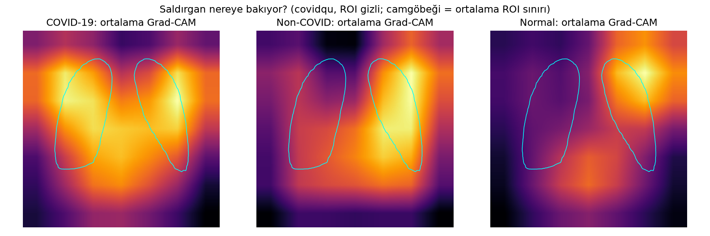

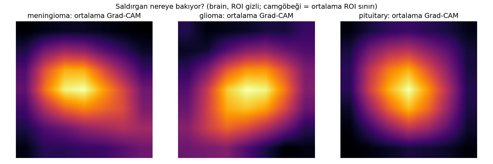

## Savunma ve gerçek bedel
| veri | politika | adim | gizli_alan | auc | hiz_kazanci_256 | hiz_kazanci_512 |
|---|---|---|---|---|---|---|
| covidqu | tamamen_gizli | 0 | 1.000 | 0.500 | 1.000 | 1.000 |
| covidqu | goruntu_roi | 0 | 0.234 | 0.990 | 4.038 | 4.174 |
| covidqu | kanonik | 0 | 0.633 | 0.974 | 1.486 | 1.570 |
| covidqu | kanonik_genis8 | 0 | 0.795 | 0.957 | 1.152 | 1.257 |
| covidqu | kanonik_genis16 | 0 | 0.911 | 0.910 | 1.026 | 1.081 |
| covidqu | kanonik_genis32 | 0 | 0.996 | 0.681 | 1.001 | 1.003 |
| covidqu | kanonik_genis64 | 0 | 1.000 | 0.500 | 1.000 | 1.000 |
| covidqu | sizinti_gudumlu | 1 | 0.692 | 0.965 | 1.336 | 1.448 |
| covidqu | sizinti_gudumlu | 2 | 0.744 | 0.946 | 1.227 | 1.356 |
| covidqu | sizinti_gudumlu | 3 | 0.782 | 0.940 | 1.169 | 1.281 |
| covidqu | sizinti_gudumlu | 4 | 0.827 | 0.919 | 1.112 | 1.203 |
| covidqu | sizinti_gudumlu | 5 | 0.862 | 0.899 | 1.071 | 1.148 |
| covidqu | sizinti_gudumlu | 6 | 0.900 | 0.883 | 1.030 | 1.093 |
| covidqu | sizinti_gudumlu | 7 | 0.931 | 0.864 | 1.020 | 1.062 |
| covidqu | sizinti_gudumlu | 8 | 0.955 | 0.830 | 1.013 | 1.039 |
| covidqu | sizinti_gudumlu | 9 | 0.981 | 0.776 | 1.005 | 1.016 |
| covidqu | sizinti_gudumlu | 10 | 1.000 | 0.500 | 1.000 | 1.000 |
| covidqu | rastgele_0 | 2 | 0.721 | 0.966 | 1.274 | 1.396 |
| covidqu | rastgele_0 | 4 | 0.789 | 0.959 | 1.160 | 1.269 |
| covidqu | rastgele_0 | 6 | 0.866 | 0.948 | 1.067 | 1.141 |
| covidqu | rastgele_0 | 8 | 0.933 | 0.920 | 1.019 | 1.060 |
| covidqu | rastgele_0 | 10 | 1.000 | 0.500 | 1.000 | 1.000 |
| covidqu | rastgele_1 | 2 | 0.729 | 0.958 | 1.256 | 1.381 |
| covidqu | rastgele_1 | 4 | 0.809 | 0.950 | 1.134 | 1.233 |
| covidqu | rastgele_1 | 6 | 0.866 | 0.936 | 1.067 | 1.141 |
| covidqu | rastgele_1 | 8 | 0.937 | 0.895 | 1.018 | 1.056 |
| covidqu | rastgele_1 | 10 | 1.000 | 0.500 | 1.000 | 1.000 |
| brain | tamamen_gizli | 0 | 1.000 | 0.500 | 1.000 | 1.000 |
| brain | goruntu_roi | 0 | 0.016 | 0.941 | 8.645 | 24.240 |
| brain | kanonik | 0 | 0.334 | 0.910 | 2.936 | 2.933 |
| brain | kanonik_genis8 | 0 | 0.439 | 0.920 | 2.262 | 2.217 |
| brain | kanonik_genis16 | 0 | 0.550 | 0.918 | 1.767 | 1.783 |
| brain | kanonik_genis32 | 0 | 0.791 | 0.892 | 1.157 | 1.265 |
| brain | kanonik_genis64 | 0 | 1.000 | 0.619 | 1.000 | 1.000 |
| brain | sizinti_gudumlu | 1 | 0.396 | 0.910 | 2.494 | 2.460 |
| brain | sizinti_gudumlu | 2 | 0.457 | 0.896 | 2.174 | 2.126 |
| brain | sizinti_gudumlu | 3 | 0.516 | 0.901 | 1.915 | 1.886 |
| brain | sizinti_gudumlu | 4 | 0.568 | 0.900 | 1.697 | 1.732 |
| brain | sizinti_gudumlu | 5 | 0.623 | 0.893 | 1.515 | 1.593 |
| brain | sizinti_gudumlu | 6 | 0.672 | 0.889 | 1.383 | 1.487 |
| brain | sizinti_gudumlu | 7 | 0.720 | 0.892 | 1.275 | 1.397 |
| brain | sizinti_gudumlu | 8 | 0.778 | 0.872 | 1.175 | 1.289 |
| brain | sizinti_gudumlu | 9 | 0.841 | 0.859 | 1.096 | 1.180 |
| brain | sizinti_gudumlu | 10 | 0.884 | 0.842 | 1.047 | 1.115 |
| brain | sizinti_gudumlu | 11 | 0.946 | 0.859 | 1.015 | 1.047 |
| brain | sizinti_gudumlu | 12 | 0.996 | 0.811 | 1.001 | 1.004 |
| brain | sizinti_gudumlu | 13 | 1.000 | 0.500 | 1.000 | 1.000 |
| brain | rastgele_0 | 2 | 0.434 | 0.913 | 2.283 | 2.239 |
| brain | rastgele_0 | 4 | 0.529 | 0.916 | 1.854 | 1.844 |
| brain | rastgele_0 | 6 | 0.632 | 0.913 | 1.490 | 1.573 |
| brain | rastgele_0 | 8 | 0.736 | 0.894 | 1.242 | 1.369 |
| brain | rastgele_0 | 10 | 0.819 | 0.894 | 1.122 | 1.216 |
| brain | rastgele_0 | 12 | 0.938 | 0.862 | 1.018 | 1.056 |
| brain | rastgele_0 | 13 | 1.000 | 0.500 | 1.000 | 1.000 |
| brain | rastgele_1 | 2 | 0.424 | 0.909 | 2.335 | 2.294 |
| brain | rastgele_1 | 4 | 0.517 | 0.897 | 1.910 | 1.883 |
| brain | rastgele_1 | 6 | 0.622 | 0.886 | 1.519 | 1.596 |
| brain | rastgele_1 | 8 | 0.734 | 0.881 | 1.246 | 1.372 |
| brain | rastgele_1 | 10 | 0.850 | 0.878 | 1.085 | 1.165 |
| brain | rastgele_1 | 12 | 0.938 | 0.858 | 1.018 | 1.056 |
| brain | rastgele_1 | 13 | 1.000 | 0.500 | 1.000 | 1.000 |

```json
{
  "brain": {
    "AUC<=0.8 icin min gizli alan (sizinti_gudumlu)": 1.0,
    "AUC<=0.7 icin min gizli alan (sizinti_gudumlu)": 1.0,
    "AUC<=0.6 icin min gizli alan (sizinti_gudumlu)": 1.0,
    "goruntu_roi AUC": 0.9409431483307976,
    "kanonik AUC": 0.9099113222382939
  },
  "covidqu": {
    "AUC<=0.8 icin min gizli alan (sizinti_gudumlu)": 0.9809036980635467,
    "AUC<=0.7 icin min gizli alan (sizinti_gudumlu)": 1.0,
    "AUC<=0.6 icin min gizli alan (sizinti_gudumlu)": 1.0,
    "goruntu_roi AUC": 0.9895731284478012,
    "kanonik AUC": 0.9737116284276577
  }
}
```

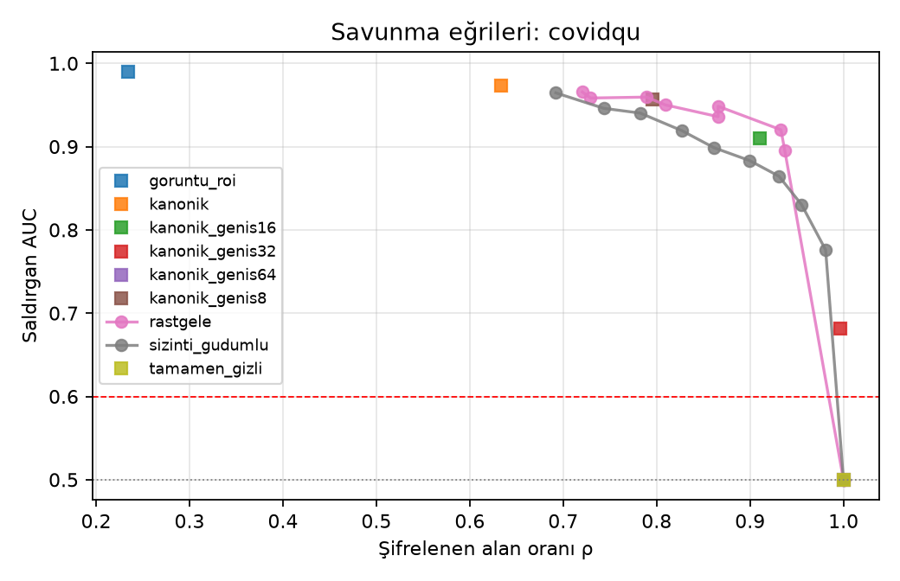

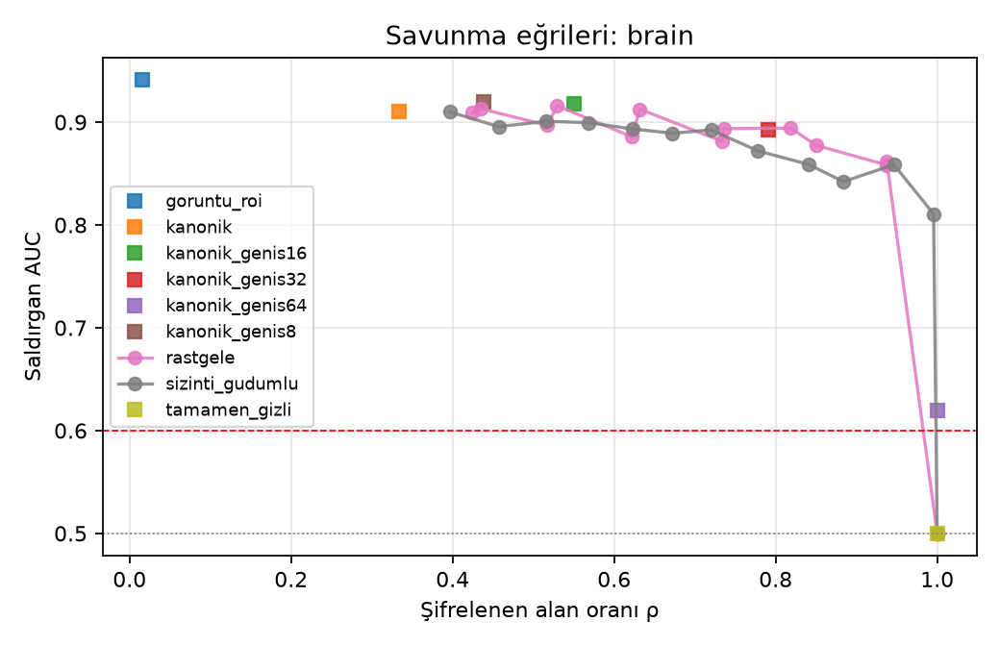

## Çözüm: Odaklı Tam Şifreleme (FoveaHE)

Seçicilik şifrelemede değil çözünürlükte: istemci ROI merkezli, sabit boyutlu, çok çözünürlüklü bir temsil çıkarır ve tamamını şifreler; sunucuya açık piksel ya da değişken meta veri gitmez.

### Adım 1 — bilgi kaybı: hangi temsil yetiyor?

| veri | yapilandirma | sifreli_deger | ciphertext | tohum_sayisi | auc_ort | auc_std | ci95_alt | ci95_ust | auc_kat_ort | tam_fark | olcut |
|---|---|---|---|---|---|---|---|---|---|---|---|
| akciğer grafisi (COVID-QU-Ex) | sabit | 0 | 0 | 1 | 0.5000 |  | 0.5000 | 0.5000 |  | 0.4966 | - |
| akciğer grafisi (COVID-QU-Ex) | U32 | 1024 | 1 | 5 | 0.9940 | 0.0002 |  |  |  | 0.0024 | evet |
| akciğer grafisi (COVID-QU-Ex) | F32_G16 | 1283 | 1 | 5 | 0.9937 | 0.0001 |  |  |  | 0.0027 | evet |
| akciğer grafisi (COVID-QU-Ex) | F32_P16k2_G16 | 1539 | 1 | 1 | 0.9937 |  | 0.9925 | 0.9948 |  | 0.0029 | evet |
| akciğer grafisi (COVID-QU-Ex) | F32_P16k3_G16 | 1539 | 1 | 1 | 0.9937 |  | 0.9925 | 0.9948 |  | 0.0029 | evet |
| akciğer grafisi (COVID-QU-Ex) | F32_G32 | 2051 | 1 | 1 | 0.9943 |  | 0.9932 | 0.9954 |  | 0.0023 | evet |
| akciğer grafisi (COVID-QU-Ex) | U48 | 2304 | 1 | 1 | 0.9947 |  | 0.9937 | 0.9956 |  | 0.0019 | evet |
| akciğer grafisi (COVID-QU-Ex) | F32_P16k2_G32 | 2307 | 1 | 1 | 0.9943 |  | 0.9932 | 0.9954 |  | 0.0023 | evet |
| akciğer grafisi (COVID-QU-Ex) | F32_P16k3_G32 | 2307 | 1 | 1 | 0.9943 |  | 0.9932 | 0.9954 |  | 0.0023 | evet |
| akciğer grafisi (COVID-QU-Ex) | F32_P32k2_G16 | 2307 | 1 | 1 | 0.9937 |  | 0.9925 | 0.9947 |  | 0.0029 | evet |
| akciğer grafisi (COVID-QU-Ex) | F32_P32k3_G16 | 2307 | 1 | 1 | 0.9932 |  | 0.9920 | 0.9944 |  | 0.0034 | evet |
| akciğer grafisi (COVID-QU-Ex) | F32_P32k2_G32 | 3075 | 1 | 1 | 0.9941 |  | 0.9930 | 0.9951 |  | 0.0025 | evet |
| akciğer grafisi (COVID-QU-Ex) | F32_P32k3_G32 | 3075 | 1 | 1 | 0.9943 |  | 0.9932 | 0.9954 |  | 0.0023 | evet |
| akciğer grafisi (COVID-QU-Ex) | U64 | 4096 | 1 | 5 | 0.9950 | 0.0002 |  |  |  | 0.0014 | evet |
| akciğer grafisi (COVID-QU-Ex) | U64_pencere | 4099 | 1 | 1 | 0.9951 |  | 0.9941 | 0.9960 |  | 0.0015 | evet |
| akciğer grafisi (COVID-QU-Ex) | F64 | 4099 | 1 | 1 | 0.9945 |  | 0.9934 | 0.9956 |  | 0.0021 | evet |
| akciğer grafisi (COVID-QU-Ex) | F64_G16 | 4355 | 1 | 1 | 0.9950 |  | 0.9940 | 0.9959 |  | 0.0016 | evet |
| akciğer grafisi (COVID-QU-Ex) | F64_P16k2_G16 | 4611 | 1 | 1 | 0.9950 |  | 0.9939 | 0.9959 |  | 0.0016 | evet |
| akciğer grafisi (COVID-QU-Ex) | F64_P16k3_G16 | 4611 | 1 | 1 | 0.9950 |  | 0.9940 | 0.9959 |  | 0.0016 | evet |
| akciğer grafisi (COVID-QU-Ex) | F64_G32 | 5123 | 1 | 5 | 0.9951 | 0.0003 |  |  |  | 0.0013 | evet |
| akciğer grafisi (COVID-QU-Ex) | F64_P16k2_G32 | 5379 | 1 | 1 | 0.9955 |  | 0.9945 | 0.9964 |  | 0.0011 | evet |
| akciğer grafisi (COVID-QU-Ex) | F64_P16k3_G32 | 5379 | 1 | 1 | 0.9955 |  | 0.9945 | 0.9964 |  | 0.0011 | evet |
| akciğer grafisi (COVID-QU-Ex) | F64_P32k2_G16 | 5379 | 1 | 1 | 0.9950 |  | 0.9940 | 0.9959 |  | 0.0016 | evet |
| akciğer grafisi (COVID-QU-Ex) | F64_P32k3_G16 | 5379 | 1 | 1 | 0.9951 |  | 0.9941 | 0.9960 |  | 0.0015 | evet |
| akciğer grafisi (COVID-QU-Ex) | F64_P32k2_G32 | 6147 | 1 | 1 | 0.9954 |  | 0.9944 | 0.9963 |  | 0.0012 | evet |
| akciğer grafisi (COVID-QU-Ex) | F64_P32k3_G32 | 6147 | 1 | 1 | 0.9955 |  | 0.9945 | 0.9964 |  | 0.0011 | evet |
| akciğer grafisi (COVID-QU-Ex) | U90 | 8100 | 1 | 1 | 0.9954 |  | 0.9944 | 0.9964 |  | 0.0012 | evet |
| akciğer grafisi (COVID-QU-Ex) | U90_pencere | 8103 | 1 | 1 | 0.9955 |  | 0.9945 | 0.9963 |  | 0.0011 | evet |
| akciğer grafisi (COVID-QU-Ex) | U128 | 16384 | 2 | 1 | 0.9961 |  | 0.9952 | 0.9969 |  | 0.0005 | evet |
| akciğer grafisi (COVID-QU-Ex) | tam | 50176 | 7 | 5 | 0.9964 | 0.0001 |  |  |  | 0.0000 | - |
| akciğer grafisi (COVID-QU-Ex) | tam_pencere | 50179 | 7 | 1 | 0.9964 |  | 0.9956 | 0.9973 |  | 0.0002 | evet |
| beyin MR (Cheng) | sabit | 0 | 0 | 1 | 0.5050 |  | 0.4464 | 0.5667 | 0.5000 | 0.4775 | - |
| beyin MR (Cheng) | U32 | 1024 | 1 | 5 | 0.9793 | 0.0015 |  |  | 0.9809 | 0.0048 | evet |
| beyin MR (Cheng) | U32_pencere | 1027 | 1 | 5 | 0.9880 | 0.0011 |  |  | 0.9893 | -0.0039 | evet |
| beyin MR (Cheng) | F32_G16 | 1283 | 1 | 5 | 0.9919 | 0.0009 |  |  | 0.9930 | -0.0078 | evet |
| beyin MR (Cheng) | F32_P16k2_G16 | 1539 | 1 | 1 | 0.9906 |  | 0.9804 | 0.9967 | 0.9920 | -0.0081 | evet |
| beyin MR (Cheng) | F32_P16k3_G16 | 1539 | 1 | 1 | 0.9904 |  | 0.9806 | 0.9963 | 0.9918 | -0.0080 | evet |
| beyin MR (Cheng) | F32_G32 | 2051 | 1 | 1 | 0.9938 |  | 0.9874 | 0.9976 | 0.9946 | -0.0114 | evet |
| beyin MR (Cheng) | U48 | 2304 | 1 | 1 | 0.9831 |  | 0.9624 | 0.9947 | 0.9850 | -0.0007 | evet |
| beyin MR (Cheng) | F32_P16k2_G32 | 2307 | 1 | 1 | 0.9927 |  | 0.9843 | 0.9977 | 0.9936 | -0.0102 | evet |
| beyin MR (Cheng) | F32_P16k3_G32 | 2307 | 1 | 1 | 0.9936 |  | 0.9873 | 0.9974 | 0.9946 | -0.0111 | evet |
| beyin MR (Cheng) | F32_P32k2_G16 | 2307 | 1 | 1 | 0.9916 |  | 0.9841 | 0.9969 | 0.9929 | -0.0091 | evet |
| beyin MR (Cheng) | F32_P32k3_G16 | 2307 | 1 | 1 | 0.9917 |  | 0.9823 | 0.9972 | 0.9928 | -0.0093 | evet |
| beyin MR (Cheng) | F32_P32k2_G32 | 3075 | 1 | 1 | 0.9919 |  | 0.9819 | 0.9976 | 0.9931 | -0.0095 | evet |
| beyin MR (Cheng) | F32_P32k3_G32 | 3075 | 1 | 1 | 0.9896 |  | 0.9784 | 0.9964 | 0.9914 | -0.0071 | evet |
| beyin MR (Cheng) | U64 | 4096 | 1 | 5 | 0.9844 | 0.0009 |  |  | 0.9867 | -0.0003 | evet |
| beyin MR (Cheng) | F64 | 4099 | 1 | 1 | 0.9849 |  | 0.9775 | 0.9913 | 0.9854 | -0.0024 | evet |
| beyin MR (Cheng) | U64_pencere | 4099 | 1 | 5 | 0.9893 | 0.0011 |  |  | 0.9910 | -0.0052 | evet |
| beyin MR (Cheng) | F64_G16 | 4355 | 1 | 1 | 0.9911 |  | 0.9823 | 0.9966 | 0.9924 | -0.0086 | evet |
| beyin MR (Cheng) | F64_P16k2_G16 | 4611 | 1 | 1 | 0.9922 |  | 0.9852 | 0.9968 | 0.9929 | -0.0097 | evet |
| beyin MR (Cheng) | F64_P16k3_G16 | 4611 | 1 | 1 | 0.9916 |  | 0.9831 | 0.9970 | 0.9935 | -0.0092 | evet |
| beyin MR (Cheng) | F64_G32 | 5123 | 1 | 5 | 0.9936 | 0.0006 |  |  | 0.9945 | -0.0095 | evet |
| beyin MR (Cheng) | F64_P16k2_G32 | 5379 | 1 | 1 | 0.9938 |  | 0.9872 | 0.9978 | 0.9943 | -0.0114 | evet |
| beyin MR (Cheng) | F64_P16k3_G32 | 5379 | 1 | 1 | 0.9928 |  | 0.9855 | 0.9972 | 0.9941 | -0.0104 | evet |
| beyin MR (Cheng) | F64_P32k2_G16 | 5379 | 1 | 1 | 0.9918 |  | 0.9844 | 0.9970 | 0.9932 | -0.0093 | evet |
| beyin MR (Cheng) | F64_P32k3_G16 | 5379 | 1 | 1 | 0.9891 |  | 0.9758 | 0.9968 | 0.9908 | -0.0066 | evet |
| beyin MR (Cheng) | F64_P32k2_G32 | 6147 | 1 | 1 | 0.9902 |  | 0.9780 | 0.9973 | 0.9916 | -0.0077 | evet |
| beyin MR (Cheng) | F64_P32k3_G32 | 6147 | 1 | 1 | 0.9928 |  | 0.9850 | 0.9978 | 0.9938 | -0.0104 | evet |
| beyin MR (Cheng) | U90 | 8100 | 1 | 5 | 0.9866 | 0.0017 |  |  | 0.9887 | -0.0025 | evet |
| beyin MR (Cheng) | U90_pencere | 8103 | 1 | 5 | 0.9910 | 0.0014 |  |  | 0.9925 | -0.0069 | evet |
| beyin MR (Cheng) | U128 | 16384 | 2 | 1 | 0.9843 |  | 0.9636 | 0.9957 | 0.9874 | -0.0018 | evet |
| beyin MR (Cheng) | tam | 50176 | 7 | 5 | 0.9841 | 0.0011 |  |  | 0.9866 | 0.0000 | - |
| beyin MR (Cheng) | tam_pencere | 50179 | 7 | 5 | 0.9909 | 0.0011 |  |  | 0.9926 | -0.0068 | evet |


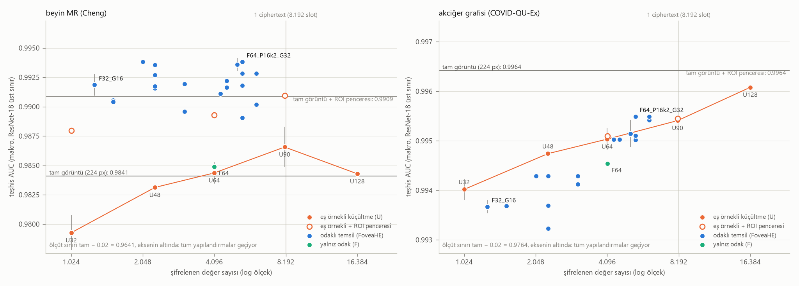

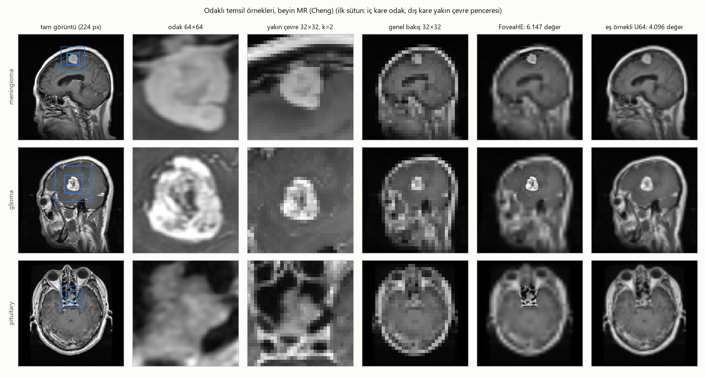

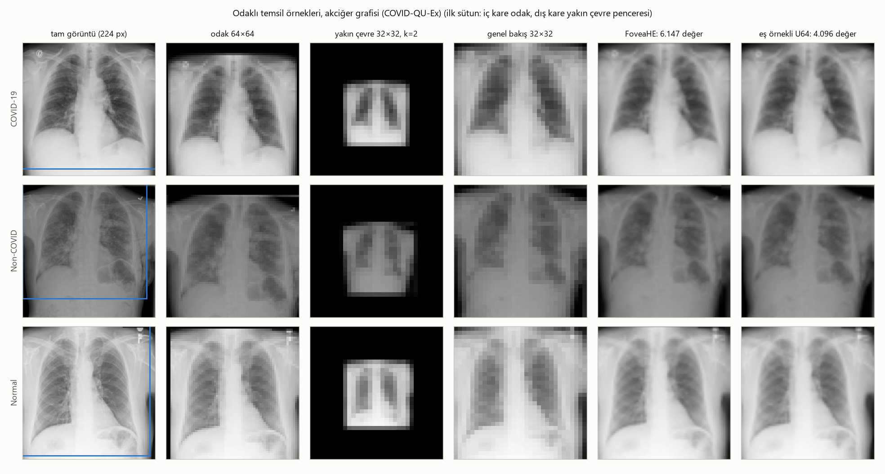

### Adım 2 — şifreli çalışabilen modeller (D, D2, C)

| veri | model | temsil | temsil_turu | sifreli_deger | tohum_sayisi | auc_ort | auc_std | auc_kat_ort | tam_fark | wd_secilen | lr_secilen | epoch_ort | sinirda | olcut |
|---|---|---|---|---|---|---|---|---|---|---|---|---|---|---|
| akciğer grafisi (COVID-QU-Ex) | C | F32_G16 | odakli | 1280 | 5 | 0.9300 | 0.0022 |  | -0.0051 | 0.01 | 0.001 | 24.2000 |  | evet |
| akciğer grafisi (COVID-QU-Ex) | C | U64 | es_ornekli | 4096 | 5 | 0.9174 | 0.0037 |  | 0.0076 | 0.01 | 0.001 | 29.2000 |  | evet |
| akciğer grafisi (COVID-QU-Ex) | C | F64 | odakli | 4096 | 1 | 0.9204 |  |  | 0.0132 | 0.0001 | 0.001 | 39.0000 |  | evet |
| akciğer grafisi (COVID-QU-Ex) | C | F64_G32 | odakli | 5120 | 5 | 0.9349 | 0.0017 |  | -0.0100 | 1 | 0.001 | 28.4000 |  | evet |
| akciğer grafisi (COVID-QU-Ex) | C | F64_P32k2_G32 | odakli | 6144 | 1 | 0.9357 |  |  | -0.0020 | 1 | 0.001 | 42.0000 |  | evet |
| akciğer grafisi (COVID-QU-Ex) | C | U90 | es_ornekli | 8100 | 1 | 0.9213 |  |  | 0.0124 | 0.01 | 0.001 | 23.0000 |  | evet |
| akciğer grafisi (COVID-QU-Ex) | C | tam | tam_224 | 50176 | 1 | 0.9292 |  |  | 0.0045 | 0.0001 | 0.001 | 21.0000 |  | evet |
| akciğer grafisi (COVID-QU-Ex) | C | U256 | tam_orijinal | 65536 | 5 | 0.9249 | 0.0091 |  | 0.0000 | 0.01 | 0.001 | 17.6000 |  | - |
| akciğer grafisi (COVID-QU-Ex) | D | sabit | sabit | 0 | 1 | 0.5000 |  |  | 0.4011 | 1 | 0.001 | 5.0000 |  | - |
| akciğer grafisi (COVID-QU-Ex) | D | F32_G16 | odakli | 1283 | 5 | 0.9151 | 0.0015 |  | -0.0198 | 0.01 | 0.001 | 22.6000 |  | evet |
| akciğer grafisi (COVID-QU-Ex) | D | U64 | es_ornekli | 4096 | 5 | 0.8654 | 0.0018 |  | 0.0299 | 0.01 | 0.001 | 18.2000 |  | evet |
| akciğer grafisi (COVID-QU-Ex) | D | F64 | odakli | 4099 | 1 | 0.9004 |  |  | 0.0007 | 0.0001 | 0.001 | 13.0000 |  | evet |
| akciğer grafisi (COVID-QU-Ex) | D | F64_G32 | odakli | 5123 | 5 | 0.9150 | 0.0017 |  | -0.0198 | 0.01 | 0.001 | 22.8000 |  | evet |
| akciğer grafisi (COVID-QU-Ex) | D | F64_P32k2_G32 | odakli | 6147 | 1 | 0.9151 |  |  | -0.0140 | 0.01 | 0.001 | 19.0000 |  | evet |
| akciğer grafisi (COVID-QU-Ex) | D | U90 | es_ornekli | 8100 | 1 | 0.8754 |  |  | 0.0257 | 0.01 | 0.001 | 40.0000 |  | evet |
| akciğer grafisi (COVID-QU-Ex) | D | tam | tam_224 | 50176 | 1 | 0.8892 |  |  | 0.0119 | 0.0001 | 0.001 | 16.0000 |  | evet |
| akciğer grafisi (COVID-QU-Ex) | D | U256 | tam_orijinal | 65536 | 5 | 0.8953 | 0.0062 |  | 0.0000 | 0.0001 | 0.001 | 12.2000 |  | - |
| akciğer grafisi (COVID-QU-Ex) | D2 | sabit | sabit | 0 | 1 | 0.5000 |  |  | 0.4465 | 1 | 0.001 | 7.0000 |  | - |
| akciğer grafisi (COVID-QU-Ex) | D2 | F32_G16 | odakli | 1283 | 5 | 0.9543 | 0.0017 |  | -0.0082 | 0.01 | 0.001 | 16.0000 |  | evet |
| akciğer grafisi (COVID-QU-Ex) | D2 | U64 | es_ornekli | 4096 | 5 | 0.9377 | 0.0018 |  | 0.0083 | 0.0001 | 0.001 | 11.0000 |  | evet |
| akciğer grafisi (COVID-QU-Ex) | D2 | F64 | odakli | 4099 | 1 | 0.9461 |  |  | 0.0004 | 0.01 | 0.001 | 11.0000 |  | evet |
| akciğer grafisi (COVID-QU-Ex) | D2 | F64_G32 | odakli | 5123 | 5 | 0.9519 | 0.0013 |  | -0.0058 | 0.01 | 0.001 | 15.0000 |  | evet |
| akciğer grafisi (COVID-QU-Ex) | D2 | F64_P32k2_G32 | odakli | 6147 | 1 | 0.9524 |  |  | -0.0059 | 0.01 | 0.001 | 10.0000 |  | evet |
| akciğer grafisi (COVID-QU-Ex) | D2 | U90 | es_ornekli | 8100 | 1 | 0.9413 |  |  | 0.0052 | 0.01 | 0.001 | 11.0000 |  | evet |
| akciğer grafisi (COVID-QU-Ex) | D2 | tam | tam_224 | 50176 | 1 | 0.9386 |  |  | 0.0079 | 0.0001 | 0.001 | 10.0000 |  | evet |
| akciğer grafisi (COVID-QU-Ex) | D2 | U256 | tam_orijinal | 65536 | 5 | 0.9460 | 0.0012 |  | 0.0000 | 0.0001 | 0.001 | 17.2000 |  | - |
| beyin MR (Cheng) | C | F32_G16 | odakli | 1280 | 5 | 0.9437 | 0.0060 | 0.9463 | -0.0919 | 1/1/1/1/1 | 0.001/0.001/0.001/0.001/0.001 | 49.9200 |  | evet |
| beyin MR (Cheng) | C | U64 | es_ornekli | 4096 | 5 | 0.8482 | 0.0078 | 0.8561 | 0.0037 | 1/1/1/1/0.01 | 0.001/0.001/0.001/0.001/0.001 | 6.8400 |  | evet |
| beyin MR (Cheng) | C | F64 | odakli | 4096 | 1 | 0.8877 |  | 0.8908 | -0.0462 | 1/1/1/1/1 | 0.001/0.001/0.001/0.001/0.001 | 29.6000 |  | evet |
| beyin MR (Cheng) | C | F64_G32 | odakli | 5120 | 5 | 0.9267 | 0.0144 | 0.9306 | -0.0749 | 1/1/1/1/1 | 0.001/0.001/0.001/0.001/0.001 | 27.8800 |  | evet |
| beyin MR (Cheng) | C | F64_P32k2_G32 | odakli | 6144 | 1 | 0.8970 |  | 0.9111 | -0.0556 | 1/1/1/1/1 | 0.001/0.001/0.001/0.001/0.001 | 6.8000 |  | evet |
| beyin MR (Cheng) | C | U90 | es_ornekli | 8100 | 1 | 0.8470 |  | 0.8516 | -0.0055 | 1/1/1/1/1 | 0.001/0.001/0.001/0.001/0.001 | 7.8000 |  | evet |
| beyin MR (Cheng) | C | tam | tam_224 | 50176 | 1 | 0.8459 |  | 0.8533 | -0.0045 | 1/1/1/1/0.01 | 0.001/0.001/0.001/0.001/0.001 | 6.2000 |  | evet |
| beyin MR (Cheng) | C | U512 | tam_orijinal | 262144 | 5 | 0.8518 | 0.0076 | 0.8576 | 0.0000 | 10/1/1/1/1 | 0.001/0.001/0.001/0.001/0.001 | 7.5600 |  | - |
| beyin MR (Cheng) | D | sabit | sabit | 0 | 1 | 0.4707 |  | 0.5000 | 0.4106 | 0.0001/0.0001/0.0001/1/0.0001 | 0.001/0.001/0.001/0.001/0.001 | 6.8000 |  | - |
| beyin MR (Cheng) | D | F32_G16 | odakli | 1283 | 5 | 0.9479 | 0.0010 | 0.9503 | -0.0669 | 10/1/1/10/10 | 0.001/0.001/0.001/0.001/0.001 | 18.0800 |  | evet |
| beyin MR (Cheng) | D | U64 | es_ornekli | 4096 | 5 | 0.8815 | 0.0023 | 0.8846 | -0.0004 | 10/10/10/10/10 | 0.001/0.001/0.001/0.001/0.001 | 9.2000 |  | evet |
| beyin MR (Cheng) | D | F64 | odakli | 4099 | 1 | 0.8635 |  | 0.8664 | 0.0178 | 10/10/10/10/100 | 0.001/0.001/0.001/0.001/0.0001 | 7.6000 |  | evet |
| beyin MR (Cheng) | D | F64_G32 | odakli | 5123 | 5 | 0.9454 | 0.0017 | 0.9471 | -0.0643 | 10/10/10/10/10 | 0.001/0.001/0.001/0.001/0.001 | 11.8000 |  | evet |
| beyin MR (Cheng) | D | F64_P32k2_G32 | odakli | 6147 | 1 | 0.9532 |  | 0.9556 | -0.0719 | 10/10/10/10/10 | 0.001/0.001/0.001/0.001/0.001 | 6.6000 |  | evet |
| beyin MR (Cheng) | D | U90 | es_ornekli | 8100 | 1 | 0.8805 |  | 0.8823 | 0.0008 | 10/10/10/10/10 | 0.001/0.001/0.001/0.001/0.001 | 5.8000 |  | evet |
| beyin MR (Cheng) | D | tam | tam_224 | 50176 | 1 | 0.8757 |  | 0.8824 | 0.0056 | 100/100/10/100/10 | 0.0001/0.0001/0.001/0.0001/0.001 | 9.4000 |  | evet |
| beyin MR (Cheng) | D | U512 | tam_orijinal | 262144 | 5 | 0.8811 | 0.0044 | 0.8837 | 0.0000 | 100/100/10/100/100 | 0.0001/0.001/0.001/0.0001/0.0001 | 19.8400 |  | - |
| beyin MR (Cheng) | D2 | sabit | sabit | 0 | 1 | 0.4815 |  | 0.5000 | 0.4003 | 0.01/0.01/0.0001/10/0.0001 | 0.001/0.001/0.001/0.001/0.001 | 5.6000 |  | - |
| beyin MR (Cheng) | D2 | F32_G16 | odakli | 1283 | 5 | 0.9085 | 0.0058 | 0.9090 | -0.0366 | 1/0.01/1/1/1 | 0.001/0.001/0.001/0.001/0.001 | 24.2400 |  | evet |
| beyin MR (Cheng) | D2 | U64 | es_ornekli | 4096 | 5 | 0.8640 | 0.0048 | 0.8665 | 0.0079 | 1/0.0001/0.0001/0.0001/0.0001 | 0.001/0.001/0.001/0.001/0.001 | 5.7200 |  | evet |
| beyin MR (Cheng) | D2 | F64 | odakli | 4099 | 1 | 0.8500 |  | 0.8525 | 0.0319 | 1/1/1/1/1 | 0.001/0.001/0.001/0.001/0.001 | 21.8000 |  | hayır |
| beyin MR (Cheng) | D2 | F64_G32 | odakli | 5123 | 5 | 0.9103 | 0.0048 | 0.9114 | -0.0384 | 1/1/1/1/1 | 0.001/0.001/0.001/0.001/0.001 | 16.5200 |  | evet |
| beyin MR (Cheng) | D2 | F64_P32k2_G32 | odakli | 6147 | 1 | 0.9029 |  | 0.9066 | -0.0210 | 0.01/1/0.01/1/1 | 0.001/0.001/0.001/0.001/0.001 | 16.6000 |  | evet |
| beyin MR (Cheng) | D2 | U90 | es_ornekli | 8100 | 1 | 0.8614 |  | 0.8617 | 0.0205 | 1/0.0001/0.01/0.0001/0.0001 | 0.001/0.001/0.001/0.001/0.001 | 6.6000 |  | evet |
| beyin MR (Cheng) | D2 | tam | tam_224 | 50176 | 1 | 0.8723 |  | 0.8731 | 0.0096 | 1/1/0.01/0.0001/0.01 | 0.001/0.001/0.001/0.001/0.001 | 11.8000 |  | evet |
| beyin MR (Cheng) | D2 | U512 | tam_orijinal | 262144 | 5 | 0.8719 | 0.0062 | 0.8736 | 0.0000 | 1/0.01/1/1/0.0001 | 0.001/0.001/0.001/0.001/0.001 | 19.0000 |  | - |


### Adım 3 — şifreli doğruluk eşleşmesi ve maliyet

| veri | model | temsil | n | maks_mutlak_logit_hatasi | ort_mutlak_logit_hatasi | argmax_uyumu | auc_sifresiz | auc_sifreli | auc_farki | sure_s |
|---|---|---|---|---|---|---|---|---|---|---|
| beyin MR (Cheng) | D | F32_G16 | 120 | 2.87e-05 | 8.91e-06 | 1 | 0.93 | 0.93 | 0 | 144 |
| beyin MR (Cheng) | D2 | F32_G16 | 120 | 8.23e-05 | 1.22e-05 | 1 | 0.921 | 0.921 | 0 | 154 |
| beyin MR (Cheng) | C | F32_G16 | 120 | 0.000141 | 3.45e-05 | 1 | 0.944 | 0.944 | 0 | 56.4 |
| beyin MR (Cheng) | D | F64_G32 | 120 | 3.88e-05 | 1.08e-05 | 1 | 0.938 | 0.938 | 0 | 165 |
| beyin MR (Cheng) | D2 | F64_G32 | 120 | 0.000102 | 1.36e-05 | 1 | 0.932 | 0.932 | 0 | 176 |
| beyin MR (Cheng) | C | F64_G32 | 120 | 0.00013 | 3.73e-05 | 1 | 0.935 | 0.935 | 0 | 65.1 |
| beyin MR (Cheng) | D | U64 | 120 | 7.23e-05 | 7.74e-06 | 1 | 0.916 | 0.916 | 0 | 153 |
| beyin MR (Cheng) | D2 | U64 | 120 | 7.49e-05 | 1.05e-05 | 1 | 0.891 | 0.891 | 0 | 164 |
| beyin MR (Cheng) | C | U64 | 120 | 7.25e-05 | 2.16e-05 | 1 | 0.874 | 0.874 | 0 | 37.9 |
| akciğer grafisi (COVID-QU-Ex) | D | F32_G16 | 120 | 3.87e-05 | 6.67e-06 | 1 | 0.899 | 0.899 | 0 | 143 |
| akciğer grafisi (COVID-QU-Ex) | D2 | F32_G16 | 120 | 0.000159 | 2.83e-05 | 1 | 0.945 | 0.945 | 0 | 152 |
| akciğer grafisi (COVID-QU-Ex) | C | F32_G16 | 120 | 6.68e-05 | 2.47e-05 | 1 | 0.92 | 0.92 | 0 | 56 |
| akciğer grafisi (COVID-QU-Ex) | D | F64_G32 | 120 | 3.78e-05 | 7.76e-06 | 1 | 0.919 | 0.919 | 0 | 164 |
| akciğer grafisi (COVID-QU-Ex) | D2 | F64_G32 | 120 | 0.000143 | 2.14e-05 | 1 | 0.955 | 0.955 | 0 | 174 |
| akciğer grafisi (COVID-QU-Ex) | C | F64_G32 | 120 | 7.21e-05 | 2.58e-05 | 1 | 0.952 | 0.952 | 0 | 65.3 |
| akciğer grafisi (COVID-QU-Ex) | D | U64 | 120 | 3.82e-05 | 7.32e-06 | 1 | 0.879 | 0.879 | 0 | 153 |
| akciğer grafisi (COVID-QU-Ex) | D2 | U64 | 120 | 0.000102 | 1.69e-05 | 1 | 0.923 | 0.923 | 0 | 162 |
| akciğer grafisi (COVID-QU-Ex) | C | U64 | 120 | 7.71e-05 | 1.73e-05 | 1 | 0.906 | 0.906 | 0 | 35.4 |

| veri | aile | yontem | model | temsil | sifreli_deger | ciphertext | tekrar | istemci_on_isleme_s | sifreleme_s | sunucu_s | cozme_s | toplam_s | toplam_std | uctan_uca_s | yukleme_MB | indirme_MB | hiz_kazanci_tam | hiz_kazanci_gizlilik_sartli_piroi |
|---|---|---|---|---|---|---|---|---|---|---|---|---|---|---|---|---|---|---|
| beyin MR (Cheng) | D | tam şifreleme | D | 512 px | 262144 | 32 | 3 | 0.007 | 0.357 | 44.096 | 0.005 | 44.457 | 0.492 | 44.465 | 27.384 |  | 1.000 | 1.000 |
| beyin MR (Cheng) | C | tam şifreleme | C | 512 px | 262144 | 32 | 3 | 0.007 | 0.395 | 9.764 | 0.002 | 10.160 | 0.154 | 10.168 | 27.386 | 0.787 | 1.000 |  |
| beyin MR (Cheng) | D | FoveaHE-D | D | F32_G16 | 1283 | 1 | 3 | 0.010 | 0.010 | 1.198 | 0.005 | 1.214 | 0.049 | 1.224 | 0.856 | 1.379 | 36.635 | 36.635 |
| beyin MR (Cheng) | D | FoveaHE-D (PiROI.run) | D | F32_G16 | 1283 | 1 | 3 | 0.010 | 0.010 | 1.185 | 0.005 | 1.200 | 0.043 | 1.211 | 0.855 |  | 37.038 | 37.038 |
| beyin MR (Cheng) | D | FoveaHE-D2 | D2 | F32_G16 | 1283 | 1 | 3 | 0.009 | 0.010 | 1.267 | 0.002 | 1.279 | 0.025 | 1.288 | 0.856 | 0.787 | 34.759 | 34.759 |
| beyin MR (Cheng) | C | FoveaHE-C | C | F32_G16 | 1280 | 2 | 3 | 0.010 | 0.019 | 0.455 | 0.002 | 0.477 | 0.016 | 0.486 | 1.712 | 0.787 | 21.317 |  |
| beyin MR (Cheng) | D | FoveaHE-D | D | F64_G32 | 5123 | 1 | 3 | 0.009 | 0.010 | 1.382 | 0.005 | 1.397 | 0.048 | 1.407 | 0.856 | 1.380 | 31.815 | 31.815 |
| beyin MR (Cheng) | D | FoveaHE-D (PiROI.run) | D | F64_G32 | 5123 | 1 | 3 | 0.009 | 0.011 | 1.368 | 0.005 | 1.384 | 0.035 | 1.393 | 0.856 |  | 32.128 | 32.128 |
| beyin MR (Cheng) | D | FoveaHE-D2 | D2 | F64_G32 | 5123 | 1 | 3 | 0.012 | 0.012 | 1.519 | 0.002 | 1.533 | 0.054 | 1.545 | 0.856 | 0.787 | 29.000 | 29.000 |
| beyin MR (Cheng) | C | FoveaHE-C | C | F64_G32 | 5120 | 2 | 3 | 0.010 | 0.022 | 0.552 | 0.002 | 0.577 | 0.036 | 0.587 | 1.711 | 0.787 | 17.615 |  |
| beyin MR (Cheng) | D | FoveaHE-D | D | U64 | 4096 | 1 | 3 | 0.010 | 0.010 | 1.319 | 0.005 | 1.334 | 0.064 | 1.344 | 0.856 | 1.380 | 33.330 | 33.330 |
| beyin MR (Cheng) | D | FoveaHE-D (PiROI.run) | D | U64 | 4096 | 1 | 3 | 0.010 | 0.010 | 1.319 | 0.005 | 1.334 | 0.087 | 1.345 | 0.856 |  | 33.319 | 33.319 |
| beyin MR (Cheng) | D | FoveaHE-D2 | D2 | U64 | 4096 | 1 | 3 | 0.012 | 0.012 | 1.448 | 0.002 | 1.461 | 0.040 | 1.473 | 0.856 | 0.787 | 30.429 | 30.429 |
| beyin MR (Cheng) | C | FoveaHE-C | C | U64 | 4096 | 1 | 3 | 0.009 | 0.012 | 0.309 | 0.002 | 0.323 | 0.030 | 0.332 | 0.856 | 0.787 | 31.459 |  |
| akciğer grafisi (COVID-QU-Ex) | D | tam şifreleme | D | 256 px | 65536 | 8 | 3 | 0.004 | 0.086 | 10.267 | 0.005 | 10.358 | 0.066 | 10.362 | 6.846 |  | 1.000 | 0.995 |
| akciğer grafisi (COVID-QU-Ex) | D | Π_ROI %98 şifreli (gizlilik şartlı) | D | 256 px | 64009 | 8 | 3 | 0.004 | 0.080 | 10.219 | 0.004 | 10.304 | 0.013 | 10.308 | 6.846 |  | 1.005 | 1.000 |
| akciğer grafisi (COVID-QU-Ex) | C | tam şifreleme | C | 256 px | 65536 | 8 | 3 | 0.004 | 0.099 | 2.407 | 0.002 | 2.507 | 0.039 | 2.512 | 6.847 | 0.787 | 1.000 |  |
| akciğer grafisi (COVID-QU-Ex) | D | FoveaHE-D | D | F32_G16 | 1283 | 1 | 3 | 0.007 | 0.010 | 1.175 | 0.005 | 1.189 | 0.004 | 1.196 | 0.856 | 1.381 | 8.708 | 8.663 |
| akciğer grafisi (COVID-QU-Ex) | D | FoveaHE-D (PiROI.run) | D | F32_G16 | 1283 | 1 | 3 | 0.007 | 0.010 | 1.165 | 0.005 | 1.180 | 0.038 | 1.187 | 0.856 |  | 8.777 | 8.732 |
| akciğer grafisi (COVID-QU-Ex) | D | FoveaHE-D2 | D2 | F32_G16 | 1283 | 1 | 3 | 0.004 | 0.013 | 1.284 | 0.002 | 1.299 | 0.044 | 1.303 | 0.856 | 0.787 | 7.974 | 7.932 |
| akciğer grafisi (COVID-QU-Ex) | C | FoveaHE-C | C | F32_G16 | 1280 | 2 | 3 | 0.005 | 0.019 | 0.452 | 0.002 | 0.473 | 0.014 | 0.478 | 1.712 | 0.787 | 5.296 |  |
| akciğer grafisi (COVID-QU-Ex) | D | FoveaHE-D | D | F64_G32 | 5123 | 1 | 3 | 0.004 | 0.011 | 1.420 | 0.005 | 1.435 | 0.074 | 1.440 | 0.856 | 1.381 | 7.216 | 7.178 |
| akciğer grafisi (COVID-QU-Ex) | D | FoveaHE-D (PiROI.run) | D | F64_G32 | 5123 | 1 | 3 | 0.004 | 0.010 | 1.349 | 0.005 | 1.365 | 0.013 | 1.369 | 0.856 |  | 7.591 | 7.551 |
| akciğer grafisi (COVID-QU-Ex) | D | FoveaHE-D2 | D2 | F64_G32 | 5123 | 1 | 3 | 0.004 | 0.011 | 1.475 | 0.002 | 1.488 | 0.032 | 1.493 | 0.856 | 0.787 | 6.960 | 6.924 |
| akciğer grafisi (COVID-QU-Ex) | C | FoveaHE-C | C | F64_G32 | 5120 | 2 | 3 | 0.005 | 0.023 | 0.542 | 0.002 | 0.567 | 0.028 | 0.572 | 1.712 | 0.787 | 4.420 |  |
| akciğer grafisi (COVID-QU-Ex) | D | FoveaHE-D | D | U64 | 4096 | 1 | 3 | 0.003 | 0.010 | 1.311 | 0.005 | 1.326 | 0.062 | 1.330 | 0.856 | 1.379 | 7.810 | 7.769 |
| akciğer grafisi (COVID-QU-Ex) | D | FoveaHE-D (PiROI.run) | D | U64 | 4096 | 1 | 3 | 0.003 | 0.010 | 1.311 | 0.005 | 1.325 | 0.045 | 1.329 | 0.856 |  | 7.815 | 7.774 |
| akciğer grafisi (COVID-QU-Ex) | D | FoveaHE-D2 | D2 | U64 | 4096 | 1 | 3 | 0.003 | 0.010 | 1.371 | 0.002 | 1.383 | 0.038 | 1.386 | 0.856 | 0.787 | 7.488 | 7.449 |
| akciğer grafisi (COVID-QU-Ex) | C | FoveaHE-C | C | U64 | 4096 | 1 | 3 | 0.003 | 0.012 | 0.289 | 0.002 | 0.302 | 0.025 | 0.305 | 0.856 | 0.787 | 8.293 |  |


### Adım 4 — sızıntı denetimi: sunucunun gördüğü

# Çözüm Adım 4: sızıntı denetimi

Ana ölçü kat ortalaması saldırgan AUC'si (5 tohum; sınıf dengeli katlar, beyinde hasta bazlı). `bos_p95`: etiket permütasyonuyla boş dağılımın %95'lik değeri; `sans_duzeyinde = evet` gözlenen AUC bu değeri aşmıyor demektir. Π_ROI satırları aynı örneklem ve protokolle pozitif kontroldür.

| veri | yontem | saldiri | oznitelikler | n | auc_kat_ort | auc_std | bos_p95 | p_degeri | sans_duzeyinde | auc_havuz |
|---|---|---|---|---|---|---|---|---|---|---|
| beyin MR (Cheng) | Π_ROI | A: paket meta verisi | ciphertext sayısı, yükleme boyutu | 3064 | 0.5614 | 0.0000 | 0.5093 | 0.0099 | hayır | 0.5508 |
| beyin MR (Cheng) | FoveaHE | A: paket meta verisi | ciphertext sayısı, slot sayısı, yükleme baytı | 3064 | 0.4905 | 0.0000 | 0.5202 | 0.8515 | evet | 0.4894 |
| beyin MR (Cheng) | Π_ROI | yan kanal (alt küme) | ciphertext sayısı, yükleme boyutu (süre bunlarla doğrusal) | 450 | 0.5567 | 0.0000 | 0.5203 | 0.0099 | hayır | 0.5471 |
| beyin MR (Cheng) | FoveaHE | yan kanal (alt küme) | sunucu süresi, indirme baytı | 450 | 0.5258 | 0.0000 | 0.5462 | 0.1980 | evet | 0.5241 |
| beyin MR (Cheng) | FoveaHE | yan kanal (alt küme) | yalnızca sunucu süresi | 450 | 0.4844 | 0.0000 | 0.5398 | 0.7327 | evet | 0.4851 |
| akciğer grafisi (COVID-QU-Ex) | Π_ROI | A: paket meta verisi | ciphertext sayısı, yükleme boyutu | 3000 | 0.5732 | 0.0000 | 0.5143 | 0.0099 | hayır | 0.5648 |
| akciğer grafisi (COVID-QU-Ex) | FoveaHE | A: paket meta verisi | ciphertext sayısı, slot sayısı, yükleme baytı | 3000 | 0.5027 | 0.0000 | 0.5178 | 0.4257 | evet | 0.5027 |
| akciğer grafisi (COVID-QU-Ex) | Π_ROI | yan kanal (alt küme) | ciphertext sayısı, yükleme boyutu (süre bunlarla doğrusal) | 450 | 0.5889 | 0.0000 | 0.5327 | 0.0099 | hayır | 0.5605 |
| akciğer grafisi (COVID-QU-Ex) | FoveaHE | yan kanal (alt küme) | sunucu süresi, indirme baytı | 450 | 0.4682 | 0.0000 | 0.5350 | 0.8416 | evet | 0.4715 |
| akciğer grafisi (COVID-QU-Ex) | FoveaHE | yan kanal (alt küme) | yalnızca sunucu süresi | 450 | 0.4480 | 0.0000 | 0.5325 | 0.9802 | evet | 0.4487 |

## Referanslar (kesin tablolardan)

| veri | yontem | saldiri | oznitelikler | n | auc | kaynak |
|---|---|---|---|---|---|---|
| beyin MR (Cheng) | Π_ROI | A: ROI meta verisi | konum, boyut, şekil | 3064.0000 | 0.8299 | saldiri_A_meta_veri.csv (5 tohum, havuzlanmış kat dışı) |
| beyin MR (Cheng) | Π_ROI | B: açık bağlam (ROI gizli) | açık pikseller | 3064.0000 | 0.9765 | saldiri_B_baglam.csv (5 tohum ortalaması) |
| beyin MR (Cheng) | FoveaHE | B: açık bağlam | açık piksel yok |  |  | tanımsal olarak uygulanamaz: sunucu yalnızca ciphertext görür |
| beyin MR (Cheng) | akıl sağlığı | sunucu görüşü sabit görüntü | bilgisiz girdi | 3064.0000 | 0.5000 | cozum_bilgi.csv, Adım 1 sabit (beyinde kat ortalaması) |
| akciğer grafisi (COVID-QU-Ex) | Π_ROI | A: ROI meta verisi | konum, boyut, şekil | 6788.0000 | 0.8337 | saldiri_A_meta_veri.csv (5 tohum, havuzlanmış kat dışı) |
| akciğer grafisi (COVID-QU-Ex) | Π_ROI | B: açık bağlam (ROI gizli) | açık pikseller | 6788.0000 | 0.9932 | saldiri_B_baglam.csv (5 tohum ortalaması) |
| akciğer grafisi (COVID-QU-Ex) | FoveaHE | B: açık bağlam | açık piksel yok |  |  | tanımsal olarak uygulanamaz: sunucu yalnızca ciphertext görür |
| akciğer grafisi (COVID-QU-Ex) | akıl sağlığı | sunucu görüşü sabit görüntü | bilgisiz girdi | 6788.0000 | 0.5000 | cozum_bilgi.csv, Adım 1 sabit (beyinde kat ortalaması) |

## Sızıntı fonksiyonları: sunucunun öğrendiği

| Yöntem | Sunucunun öğrendiği |
|---|---|
| Π_ROI (ePrint 2026/103) | model ağırlıkları; ROI dışındaki tüm açık pikseller; ROI konumu, boyutu ve şekli; girdi boyutu; ROI ciphertext sayısı ve yükleme boyutu (ROI alanıyla değişir) |
| Encrypt What Matters (arXiv 2609.09357) | ROI dışı açık bölge ve ROI yerleşimi (ROI dışı açık kabul edilir) |
| Bi-CryptoNets (arXiv 2402.01296) | hassas olmayan kısım (gürültü eklenmiş ama açık) |
| FoveaHE (odaklı tam şifreleme) | yalnızca herkese açık sabitler: CKKS parametreleri (N = 16384), slot sayısı (8.192), ciphertext sayısı (1), model mimarisi; her hasta için aynı |

## Protokol kuralı (IND-CPA-D)

- Çözülen sonuç (logit, olasılık ya da karar) sunucuya geri gönderilmez; sunucuya çözme kâhini verilmez.
- Gerekçe: CKKS'de çözülmüş sonuçlara erişen sunucu gizli anahtarı kurtarabilir (IND-CPA-D; bu projedeki PoC `pilot/indcpad_poc_tenseal.py`, TenSEAL ile 0.15 s).
- Model ağırlıkları sunucuda açık metindir (Π_ROI ile aynı tehdit modeli); model gizliliği kapsam dışıdır.


### Adım 5a — rakip: şifreli özet (HETAL tarzı)

| veri | yontem | model | tohum | auc | ci95_alt | ci95_ust | n | sifreli_deger | wd_lr | aktarim_hatasi | istemci_on_isleme_s | istemci_on_isleme_tek_cekirdek_s | egitim_s | maks_mutlak_logit_hatasi | argmax_uyumu | auc_farki_eslesme | ciphertext | sifreleme_s | sunucu_s | cozme_s | toplam_s | yukleme_MB | indirme_MB | uctan_uca_s |
|---|---|---|---|---|---|---|---|---|---|---|---|---|---|---|---|---|---|---|---|---|---|---|---|---|
| beyin MR (Cheng) | şifreli özet (ImageNet ResNet-18, 512) | D | 0 | 0.9558 | 0.9362 | 0.9721 | 3064 | 512 | 10@0.001/1@0.001/1@0.001/10@0.001/1@0.001 | 0.0000 | 0.0235 | 0.0546 | 13.6971 | 0.0000 | 1.0000 | 0.0000 | 1.0000 | 0.0095 | 0.9959 | 0.0047 | 1.0101 | 0.8554 | 1.3789 | 1.0336 |
| beyin MR (Cheng) | şifreli özet (ImageNet ResNet-18, 512) | D2 | 0 | 0.9447 | 0.9244 | 0.9629 | 3064 | 512 | 1@0.001/1@0.001/1@0.001/1@0.001/0.01@0.001 | 0.0000 | 0.0235 | 0.0546 | 17.4766 | 0.0001 | 1.0000 | 0.0000 | 1.0000 | 0.0094 | 1.0651 | 0.0019 | 1.0764 | 0.8553 | 0.7869 | 1.0999 |
| akciğer grafisi (COVID-QU-Ex) | şifreli özet (ImageNet ResNet-18, 512) | D | 0 | 0.9674 | 0.9643 | 0.9702 | 6788 | 512 | 0.0001@0.001 | 0.0000 | 0.0226 | 0.0505 | 16.2306 | 0.0000 | 1.0000 | 0.0000 | 1.0000 | 0.0093 | 0.9492 | 0.0044 | 0.9629 | 0.8553 | 1.3794 | 0.9855 |
| akciğer grafisi (COVID-QU-Ex) | şifreli özet (ImageNet ResNet-18, 512) | D2 | 0 | 0.9812 | 0.9787 | 0.9832 | 6788 | 512 | 1@0.001 | 0.0000 | 0.0226 | 0.0505 | 21.9922 | 0.0000 | 1.0000 | 0.0000 | 1.0000 | 0.0090 | 1.0493 | 0.0019 | 1.0601 | 0.8553 | 0.7869 | 1.0828 |
| beyin MR (Cheng) | şifreli özet (ImageNet ResNet-18, 512) | D | 1 | 0.9554 | 0.9365 | 0.9711 | 3064 | 512 | 10@0.001/1@0.001/1@0.001/10@0.001/1@0.001 | 0.0000 | 0.0249 | 0.0582 | 12.2823 |  |  |  |  |  |  |  |  |  |  |  |
| beyin MR (Cheng) | şifreli özet (ImageNet ResNet-18, 512) | D2 | 1 | 0.9443 | 0.9260 | 0.9610 | 3064 | 512 | 1@0.001/0.01@0.001/1@0.001/1@0.001/1@0.001 | 0.0000 | 0.0249 | 0.0582 | 16.5832 |  |  |  |  |  |  |  |  |  |  |  |
| akciğer grafisi (COVID-QU-Ex) | şifreli özet (ImageNet ResNet-18, 512) | D | 1 | 0.9693 | 0.9663 | 0.9719 | 6788 | 512 | 0.01@0.001 | 0.0000 | 0.0220 | 0.0505 | 16.8261 |  |  |  |  |  |  |  |  |  |  |  |
| akciğer grafisi (COVID-QU-Ex) | şifreli özet (ImageNet ResNet-18, 512) | D2 | 1 | 0.9821 | 0.9797 | 0.9842 | 6788 | 512 | 1@0.001 | 0.0000 | 0.0220 | 0.0505 | 21.4195 |  |  |  |  |  |  |  |  |  |  |  |
| beyin MR (Cheng) | şifreli özet (ImageNet ResNet-18, 512) | D | 2 | 0.9557 | 0.9365 | 0.9718 | 3064 | 512 | 10@0.001/1@0.001/1@0.001/10@0.001/1@0.001 | 0.0000 | 0.0227 | 0.0533 | 13.2951 |  |  |  |  |  |  |  |  |  |  |  |
| beyin MR (Cheng) | şifreli özet (ImageNet ResNet-18, 512) | D2 | 2 | 0.9495 | 0.9310 | 0.9656 | 3064 | 512 | 1@0.001/1@0.001/1@0.001/1@0.001/1@0.001 | 0.0000 | 0.0227 | 0.0533 | 16.8724 |  |  |  |  |  |  |  |  |  |  |  |
| akciğer grafisi (COVID-QU-Ex) | şifreli özet (ImageNet ResNet-18, 512) | D | 2 | 0.9690 | 0.9660 | 0.9718 | 6788 | 512 | 0.01@0.001 | 0.0000 | 0.0196 | 0.0519 | 20.4905 |  |  |  |  |  |  |  |  |  |  |  |
| akciğer grafisi (COVID-QU-Ex) | şifreli özet (ImageNet ResNet-18, 512) | D2 | 2 | 0.9824 | 0.9800 | 0.9844 | 6788 | 512 | 1@0.001 | 0.0000 | 0.0196 | 0.0519 | 28.6520 |  |  |  |  |  |  |  |  |  |  |  |
| beyin MR (Cheng) | şifreli özet (ImageNet ResNet-18, 512) | D | 3 | 0.9551 | 0.9364 | 0.9706 | 3064 | 512 | 10@0.001/1@0.001/1@0.001/10@0.001/0.0001@0.001 | 0.0000 | 0.0241 | 0.0557 | 12.2980 |  |  |  |  |  |  |  |  |  |  |  |
| beyin MR (Cheng) | şifreli özet (ImageNet ResNet-18, 512) | D2 | 3 | 0.9495 | 0.9321 | 0.9650 | 3064 | 512 | 1@0.001/1@0.001/1@0.001/1@0.001/1@0.001 | 0.0000 | 0.0241 | 0.0557 | 17.2243 |  |  |  |  |  |  |  |  |  |  |  |
| akciğer grafisi (COVID-QU-Ex) | şifreli özet (ImageNet ResNet-18, 512) | D | 3 | 0.9679 | 0.9650 | 0.9707 | 6788 | 512 | 0.01@0.001 | 0.0000 | 0.0202 | 0.0507 | 18.2787 |  |  |  |  |  |  |  |  |  |  |  |
| akciğer grafisi (COVID-QU-Ex) | şifreli özet (ImageNet ResNet-18, 512) | D2 | 3 | 0.9818 | 0.9793 | 0.9839 | 6788 | 512 | 1@0.001 | 0.0000 | 0.0202 | 0.0507 | 24.5659 |  |  |  |  |  |  |  |  |  |  |  |
| beyin MR (Cheng) | şifreli özet (ImageNet ResNet-18, 512) | D | 4 | 0.9533 | 0.9338 | 0.9695 | 3064 | 512 | 10@0.001/1@0.001/1@0.001/10@0.001/0.0001@0.001 | 0.0000 | 0.0248 | 0.0543 | 10.7934 |  |  |  |  |  |  |  |  |  |  |  |
| beyin MR (Cheng) | şifreli özet (ImageNet ResNet-18, 512) | D2 | 4 | 0.9405 | 0.9213 | 0.9579 | 3064 | 512 | 1@0.001/1@0.001/1@0.001/1@0.001/1@0.001 | 0.0000 | 0.0248 | 0.0543 | 14.5963 |  |  |  |  |  |  |  |  |  |  |  |
| akciğer grafisi (COVID-QU-Ex) | şifreli özet (ImageNet ResNet-18, 512) | D | 4 | 0.9686 | 0.9656 | 0.9712 | 6788 | 512 | 0.01@0.001 | 0.0000 | 0.0217 | 0.0511 | 15.5216 |  |  |  |  |  |  |  |  |  |  |  |
| akciğer grafisi (COVID-QU-Ex) | şifreli özet (ImageNet ResNet-18, 512) | D2 | 4 | 0.9802 | 0.9777 | 0.9823 | 6788 | 512 | 1@0.001 | 0.0000 | 0.0217 | 0.0511 | 22.3646 |  |  |  |  |  |  |  |  |  |  |  |


### Adım 5b — rakip: bozuk açık bağlam (Bi-CryptoNets tarzı)

| veri | bozulma | duzey | gorus | aciklama | tohum | auc | ci95_alt | ci95_ust | n | epoch | sure_s |
|---|---|---|---|---|---|---|---|---|---|---|---|
| beyin MR (Cheng) | gauss | 0.0500 | baglam | saldırgan: ROI gizli, bağlam bozuk | 0 | 0.9713 | 0.9513 | 0.9867 | 3064 | 12 | 235.5302 |
| beyin MR (Cheng) | gauss | 0.0500 | tam | fayda: ROI temiz, bağlam bozuk | 0 | 0.9909 | 0.9804 | 0.9970 | 3064 | 12 | 188.5892 |
| beyin MR (Cheng) | gauss | 0.1000 | baglam | saldırgan: ROI gizli, bağlam bozuk | 0 | 0.9713 | 0.9516 | 0.9866 | 3064 | 12 | 188.9566 |
| beyin MR (Cheng) | gauss | 0.1000 | tam | fayda: ROI temiz, bağlam bozuk | 0 | 0.9871 | 0.9678 | 0.9971 | 3064 | 12 | 188.9603 |
| beyin MR (Cheng) | gauss | 0.2000 | baglam | saldırgan: ROI gizli, bağlam bozuk | 0 | 0.9726 | 0.9572 | 0.9858 | 3064 | 12 | 189.2143 |
| beyin MR (Cheng) | gauss | 0.2000 | tam | fayda: ROI temiz, bağlam bozuk | 0 | 0.9878 | 0.9728 | 0.9962 | 3064 | 12 | 189.0418 |
| beyin MR (Cheng) | gauss | 0.4000 | baglam | saldırgan: ROI gizli, bağlam bozuk | 0 | 0.9685 | 0.9498 | 0.9831 | 3064 | 12 | 189.4325 |
| beyin MR (Cheng) | gauss | 0.4000 | tam | fayda: ROI temiz, bağlam bozuk | 0 | 0.9862 | 0.9712 | 0.9956 | 3064 | 12 | 189.1322 |
| beyin MR (Cheng) | bulanik | 2.0000 | baglam | saldırgan: ROI gizli, bağlam bozuk | 0 | 0.9786 | 0.9616 | 0.9908 | 3064 | 12 | 192.8624 |
| beyin MR (Cheng) | bulanik | 2.0000 | tam | fayda: ROI temiz, bağlam bozuk | 0 | 0.9936 | 0.9852 | 0.9983 | 3064 | 12 | 191.4789 |
| beyin MR (Cheng) | bulanik | 4.0000 | baglam | saldırgan: ROI gizli, bağlam bozuk | 0 | 0.9784 | 0.9623 | 0.9905 | 3064 | 12 | 194.5580 |
| beyin MR (Cheng) | bulanik | 4.0000 | tam | fayda: ROI temiz, bağlam bozuk | 0 | 0.9933 | 0.9844 | 0.9982 | 3064 | 12 | 193.3005 |
| beyin MR (Cheng) | bulanik | 8.0000 | baglam | saldırgan: ROI gizli, bağlam bozuk | 0 | 0.9744 | 0.9576 | 0.9862 | 3064 | 12 | 203.7974 |
| beyin MR (Cheng) | bulanik | 8.0000 | tam | fayda: ROI temiz, bağlam bozuk | 0 | 0.9939 | 0.9876 | 0.9977 | 3064 | 12 | 200.2004 |
| akciğer grafisi (COVID-QU-Ex) | gauss | 0.0500 | baglam | saldırgan: ROI gizli, bağlam bozuk | 0 | 0.9916 | 0.9902 | 0.9930 | 6788 | 5 | 179.3511 |
| akciğer grafisi (COVID-QU-Ex) | gauss | 0.0500 | tam | fayda: ROI temiz, bağlam bozuk | 0 | 0.9961 | 0.9953 | 0.9969 | 6788 | 5 | 178.0656 |
| akciğer grafisi (COVID-QU-Ex) | gauss | 0.1000 | baglam | saldırgan: ROI gizli, bağlam bozuk | 0 | 0.9893 | 0.9877 | 0.9907 | 6788 | 5 | 178.1467 |
| akciğer grafisi (COVID-QU-Ex) | gauss | 0.1000 | tam | fayda: ROI temiz, bağlam bozuk | 0 | 0.9954 | 0.9944 | 0.9962 | 6788 | 5 | 178.3250 |
| akciğer grafisi (COVID-QU-Ex) | gauss | 0.2000 | baglam | saldırgan: ROI gizli, bağlam bozuk | 0 | 0.9864 | 0.9846 | 0.9880 | 6788 | 5 | 178.3690 |
| akciğer grafisi (COVID-QU-Ex) | gauss | 0.2000 | tam | fayda: ROI temiz, bağlam bozuk | 0 | 0.9946 | 0.9936 | 0.9956 | 6788 | 5 | 178.2065 |
| akciğer grafisi (COVID-QU-Ex) | gauss | 0.4000 | baglam | saldırgan: ROI gizli, bağlam bozuk | 0 | 0.9834 | 0.9813 | 0.9852 | 6788 | 5 | 178.3797 |
| akciğer grafisi (COVID-QU-Ex) | gauss | 0.4000 | tam | fayda: ROI temiz, bağlam bozuk | 0 | 0.9932 | 0.9921 | 0.9944 | 6788 | 5 | 178.2970 |
| akciğer grafisi (COVID-QU-Ex) | bulanik | 2.0000 | baglam | saldırgan: ROI gizli, bağlam bozuk | 0 | 0.9919 | 0.9905 | 0.9933 | 6788 | 5 | 180.7318 |
| akciğer grafisi (COVID-QU-Ex) | bulanik | 2.0000 | tam | fayda: ROI temiz, bağlam bozuk | 0 | 0.9958 | 0.9948 | 0.9967 | 6788 | 5 | 180.6566 |
| akciğer grafisi (COVID-QU-Ex) | bulanik | 4.0000 | baglam | saldırgan: ROI gizli, bağlam bozuk | 0 | 0.9912 | 0.9897 | 0.9925 | 6788 | 5 | 182.4203 |
| akciğer grafisi (COVID-QU-Ex) | bulanik | 4.0000 | tam | fayda: ROI temiz, bağlam bozuk | 0 | 0.9956 | 0.9946 | 0.9964 | 6788 | 5 | 182.0647 |
| akciğer grafisi (COVID-QU-Ex) | bulanik | 8.0000 | baglam | saldırgan: ROI gizli, bağlam bozuk | 0 | 0.9882 | 0.9866 | 0.9898 | 6788 | 5 | 188.5671 |
| akciğer grafisi (COVID-QU-Ex) | bulanik | 8.0000 | tam | fayda: ROI temiz, bağlam bozuk | 0 | 0.9943 | 0.9932 | 0.9953 | 6788 | 5 | 188.1805 |


### Adım 6 — birleşik özet: hız × doğruluk × sızıntı

| veri | yontem | model | sifreli_deger | teshis_auc | teshis_auc_std | tohum_sayisi | saldirgan_auc | sure_s | hiz_kazanci | sizinti_turu |
|---|---|---|---|---|---|---|---|---|---|---|
| beyin MR (Cheng) | tam şifreleme | D | 262144 | 0.8811 | 0.0044 | 5 | 0.5258 | 44.4573 | 1.0000 | yok |
| beyin MR (Cheng) | Π_ROI (varsayılan ROI) | D | 262144 | 0.8811 | 0.0044 | 5 | 0.9765 | 1.8341 | 24.2397 | açık pikseller + ROI meta verisi |
| beyin MR (Cheng) | Π_ROI (gizlilik şartlı, saldırgan ≤ 0.8) | D | 262144 | 0.8811 | 0.0044 | 5 | 0.8000 | 44.4514 | 1.0001 | sınırlı açık piksel |
| beyin MR (Cheng) | FoveaHE F32_G16 | D | 1283 | 0.9479 | 0.0010 | 5 | 0.5258 | 1.2135 | 36.6351 | yok |
| beyin MR (Cheng) | FoveaHE F64_G32 | D | 5123 | 0.9454 | 0.0017 | 5 | 0.5258 | 1.3974 | 31.8150 | yok |
| beyin MR (Cheng) | şifreli özet (ImageNet ResNet-18) | D | 512 | 0.9551 | 0.0010 | 5 | 0.5258 | 1.0101 | 44.0111 | yok |
| beyin MR (Cheng) | bozuk bağlam (gauss 0.4) | D | 262144 | 0.8811 | 0.0044 | 5 | 0.9685 | 1.8341 | 24.2397 | gürültülü/bulanık açık bağlam |
| akciğer grafisi (COVID-QU-Ex) | tam şifreleme | D2 | 65536 | 0.9460 | 0.0012 | 5 | 0.5027 | 10.3579 | 1.0000 | yok |
| akciğer grafisi (COVID-QU-Ex) | Π_ROI (varsayılan ROI) | D2 | 65536 | 0.9460 | 0.0012 | 5 | 0.9932 | 2.5648 | 4.0385 | açık pikseller + ROI meta verisi |
| akciğer grafisi (COVID-QU-Ex) | Π_ROI (gizlilik şartlı, saldırgan ≤ 0.8) | D2 | 65536 | 0.9460 | 0.0012 | 5 | 0.8000 | 10.3039 | 1.0052 | sınırlı açık piksel |
| akciğer grafisi (COVID-QU-Ex) | FoveaHE F32_G16 | D2 | 1283 | 0.9543 | 0.0017 | 5 | 0.5027 | 1.2990 | 7.9739 | yok |
| akciğer grafisi (COVID-QU-Ex) | FoveaHE F64_G32 | D2 | 5123 | 0.9519 | 0.0013 | 5 | 0.5027 | 1.4882 | 6.9599 | yok |
| akciğer grafisi (COVID-QU-Ex) | şifreli özet (ImageNet ResNet-18) | D2 | 512 | 0.9815 | 0.0009 | 5 | 0.5027 | 1.0601 | 9.7703 | yok |
| akciğer grafisi (COVID-QU-Ex) | bozuk bağlam (gauss 0.4) | D2 | 65536 | 0.9460 | 0.0012 | 5 | 0.9834 | 2.5648 | 4.0385 | gürültülü/bulanık açık bağlam |


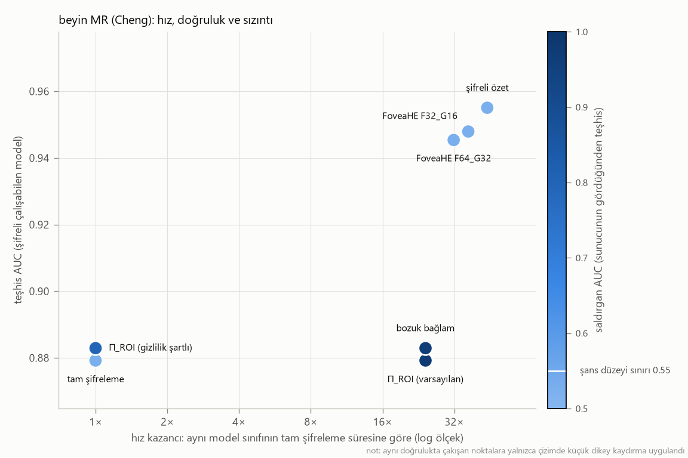

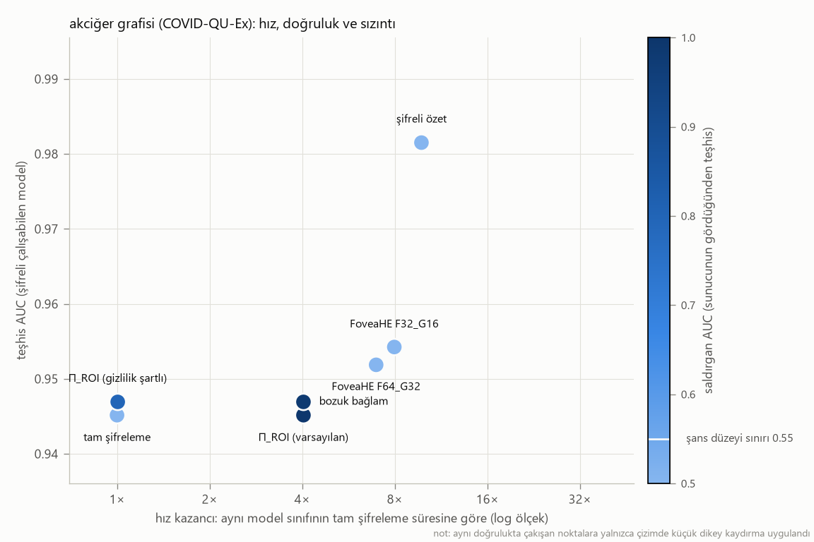

### Bonus — bütçe duyarlı odak: sabit şifreli değer bütçesinde odak payı

| veri | model | butce | yapilandirma | odak_payi | auc_ort |
|---|---|---|---|---|---|
| akciğer grafisi (COVID-QU-Ex) | C | 1024 | F22_G23 | 0.4764 | 0.9322 |
| akciğer grafisi (COVID-QU-Ex) | C | 2048 | F22_G39 | 0.2410 | 0.9398 |
| akciğer grafisi (COVID-QU-Ex) | C | 4096 | F55_G32 | 0.7465 | 0.9373 |
| akciğer grafisi (COVID-QU-Ex) | C | 8192 | F45_G78 | 0.2496 | 0.9421 |
| akciğer grafisi (COVID-QU-Ex) | D | 1024 | F27_G17 | 0.7140 | 0.9146 |
| akciğer grafisi (COVID-QU-Ex) | D | 2048 | F39_G22 | 0.7575 | 0.9174 |
| akciğer grafisi (COVID-QU-Ex) | D | 4096 | F45_G45 | 0.4996 | 0.9190 |
| akciğer grafisi (COVID-QU-Ex) | D | 8192 | F45_G78 | 0.2496 | 0.9214 |
| beyin MR (Cheng) | C | 1024 | F27_G17 | 0.7140 | 0.9521 |
| beyin MR (Cheng) | C | 2048 | F39_G22 | 0.7575 | 0.9554 |
| beyin MR (Cheng) | C | 4096 | F45_G45 | 0.4996 | 0.9388 |
| beyin MR (Cheng) | C | 8192 | F78_G45 | 0.7500 | 0.9388 |
| beyin MR (Cheng) | D | 1024 | F16_G27 | 0.2591 | 0.9563 |
| beyin MR (Cheng) | D | 2048 | F32_G31 | 0.5151 | 0.9496 |
| beyin MR (Cheng) | D | 4096 | F45_G45 | 0.4996 | 0.9494 |
| beyin MR (Cheng) | D | 8192 | F45_G78 | 0.2496 | 0.9507 |


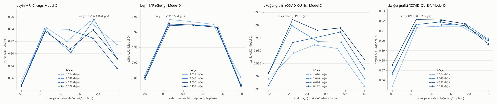

### Bonus — harici derlemede genelleme (Kaggle CXR, kopyalar çıkarılmış)

| yontem | temsil | model | sifreli_deger | tohum_sayisi | auc_ic | auc_kaggle | auc_kaggle_std | fark | fark_std | auc_Normal_vs_Non-COVID | auc_Normal_vs_COVID-19 | auc_Non-COVID_vs_COVID-19 |
|---|---|---|---|---|---|---|---|---|---|---|---|---|
| tam görüntü (Π_ROI doğruluğu) | U256 | D | 65536 | 5 | 0.8953 | 0.9142 | 0.0113 | -0.0189 | 0.0122 | 0.9437 | 0.9143 | 0.9230 |
| tam görüntü (Π_ROI doğruluğu) | U256 | D2 | 65536 | 5 | 0.9460 | 0.9731 | 0.0018 | -0.0271 | 0.0017 | 0.9713 | 0.9932 | 0.9851 |
| tam görüntü (Π_ROI doğruluğu) | U256 | C | 65536 | 5 | 0.9249 | 0.9448 | 0.0053 | -0.0199 | 0.0089 | 0.9535 | 0.9786 | 0.9531 |
| eş örnekli küçültme | U64 | D | 4096 | 5 | 0.8654 | 0.8920 | 0.0190 | -0.0266 | 0.0188 | 0.9446 | 0.8905 | 0.8840 |
| eş örnekli küçültme | U64 | D2 | 4096 | 5 | 0.9377 | 0.9712 | 0.0025 | -0.0335 | 0.0038 | 0.9721 | 0.9923 | 0.9816 |
| eş örnekli küçültme | U64 | C | 4096 | 5 | 0.9174 | 0.9419 | 0.0041 | -0.0245 | 0.0076 | 0.9592 | 0.9754 | 0.9411 |
| FoveaHE | F32_G16 | D | 1283 | 5 | 0.9151 | 0.9503 | 0.0078 | -0.0352 | 0.0066 | 0.9688 | 0.9709 | 0.9507 |
| FoveaHE | F32_G16 | D2 | 1283 | 5 | 0.9543 | 0.9778 | 0.0015 | -0.0235 | 0.0014 | 0.9782 | 0.9985 | 0.9880 |
| FoveaHE | F32_G16 | C | 1280 | 5 | 0.9300 | 0.9600 | 0.0028 | -0.0300 | 0.0042 | 0.9642 | 0.9870 | 0.9684 |
| FoveaHE | F64_G32 | D | 5123 | 5 | 0.9150 | 0.9473 | 0.0052 | -0.0322 | 0.0044 | 0.9689 | 0.9664 | 0.9451 |
| FoveaHE | F64_G32 | D2 | 5123 | 5 | 0.9519 | 0.9794 | 0.0040 | -0.0275 | 0.0042 | 0.9794 | 0.9983 | 0.9889 |
| FoveaHE | F64_G32 | C | 5120 | 5 | 0.9349 | 0.9623 | 0.0032 | -0.0274 | 0.0049 | 0.9670 | 0.9914 | 0.9694 |
| şifreli özet (ImageNet ResNet-18, 512) | - | D | 512 | 5 | 0.9684 | 0.9710 | 0.0023 | -0.0026 | 0.0023 | 0.9787 | 0.9955 | 0.9741 |
| şifreli özet (ImageNet ResNet-18, 512) | - | D2 | 512 | 5 | 0.9815 | 0.9851 | 0.0021 | -0.0036 | 0.0023 | 0.9859 | 0.9927 | 0.9902 |


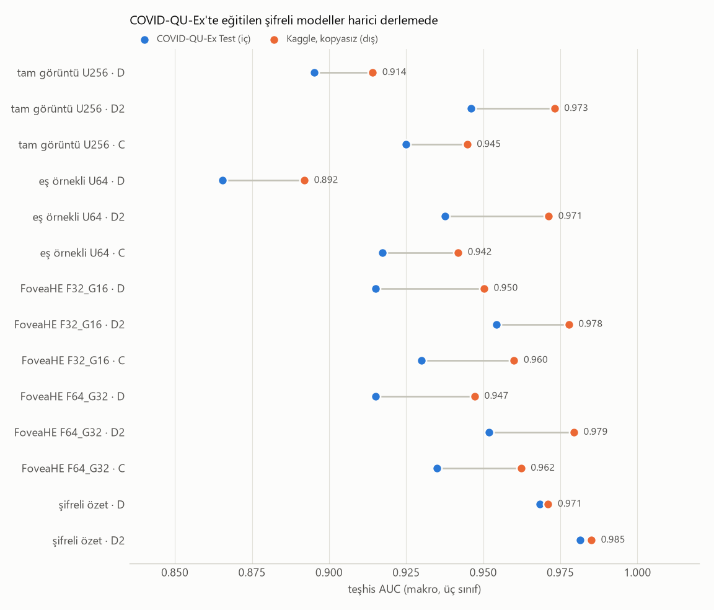
